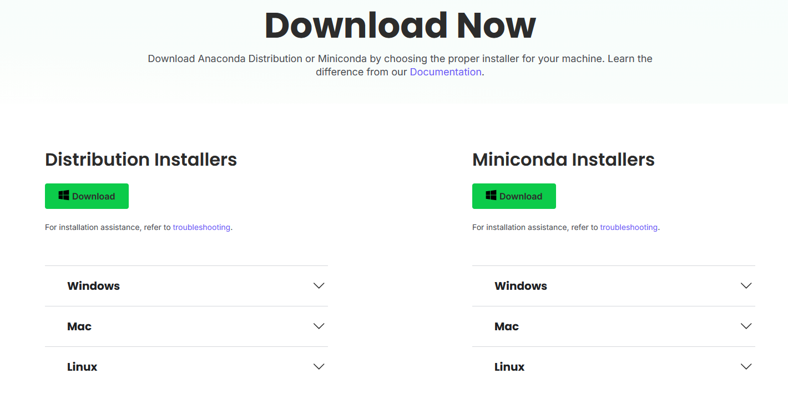

# 🛠️ Guía de instalación del entorno de programación (Windows, Ubuntu/WSL)

> Objetivo: dejar todo listo para trabajar en el taller con **Python + Jupyter Notebooks**, control de versiones con **Git/GitHub**, y (opcional) **VS Code** como editor.
> Se ofrecen dos caminos en Windows (Anaconda o binarios) y uno para Ubuntu/WSL.

---

## 0) Crear cuenta en GitHub (requisito para el taller)

1. Ir a **[github.com/signup](https://github.com/signup)** y completar el registro.
2. Verificar el email (sin verificación algunas funciones no estarán disponibles).

---

## 1) Configurar credenciales de Git (común a todos los métodos)

> Podés autenticarte por **HTTPS** (más simple) o **SSH** (recomendado a mediano plazo).

### 1.1 HTTPS (rápido)
```bash
git config --global user.name "Tu Nombre"
git config --global user.email "tu-email@ejemplo.com"
git config --global credential.helper store
```

### 1.2 SSH (recomendado)
1. Generar clave:
   - **Windows (PowerShell)**:
     ```powershell
     ssh-keygen -t ed25519 -C "tu-email@ejemplo.com"
     Start-Process "$env:USERPROFILE\.ssh"
     ```
   - **Linux/WSL**:
     ```bash
     ssh-keygen -t ed25519 -C "tu-email@ejemplo.com"
     cat ~/.ssh/id_ed25519.pub
     ```
2. Copiar la clave pública y **agregarla en GitHub**: *Settings → SSH and GPG keys → New SSH key*.
3. Probar conexión:
   ```bash
   ssh -T [email protected]
   ```

---

## 2) Windows — Método A: **Anaconda** (recomendado para principiantes)

### 2.1 Instalar Anaconda (incluye Jupyter Notebook)
1. Descargar **Anaconda Distribution** para Windows desde la [página oficial](https://www.anaconda.com/products/distribution).

   

   > **Nota**: Elegir el instalador según tu sistema operativo (Windows, Mac o Linux). Si tu sistema es "viejo" o no cumple con los requerimientos de Anaconda, podés probar con **Miniconda** (versión más liviana). Para más ayuda con la instalación, consultá el [troubleshooting](https://docs.anaconda.com/anaconda/install/troubleshooting/) oficial.

2. Ejecutar el instalador (dejar las opciones por defecto).
3. Abrir **Anaconda Navigator** y lanzar **Jupyter Notebook**.

### 2.2 Instalar **Git for Windows** (incluye Git Bash)
1. Descargar e instalar desde [gitforwindows.org](https://gitforwindows.org).
2. Abrir **Git Bash** y ejecutar la sección anterior.

### 2.3 (Opcional) Instalar **Windows Terminal**
- Descargar desde [Microsoft Store](https://aka.ms/terminal).

### 2.4 Probar el entorno
```python
import sys, numpy as np, pandas as pd
print(sys.version)
print(np.__version__, pd.__version__)
```

---

## 3) Windows — Método B: **Binarios + VS Code**

### 3.1 Instalar **Python**
- Descargar desde [python.org/downloads](https://www.python.org/downloads/).
- Tildar “**Add python.exe to PATH**”.
- Verificar:
  ```powershell
  python --version
  pip --version
  ```

### 3.2 Instalar **Windows Terminal**
- Instalar desde [Microsoft Store](https://aka.ms/terminal).

### 3.3 Instalar **Git for Windows**
- Descargar desde [gitforwindows.org](https://gitforwindows.org).

### 3.4 Instalar **Visual Studio Code**
- Descargar desde [code.visualstudio.com](https://code.visualstudio.com/).

### 3.5 Instalar extensiones
- Python (Microsoft)
- Jupyter (Microsoft)

### 3.6 Probar Jupyter
```python
import math
math.factorial(5)
```

---

## 4) Ubuntu/WSL — Instalación base

### 4.1 (Windows) Instalar WSL + Ubuntu
```powershell
wsl --install
```

### 4.2 VS Code integrado
- Instalar extensión **Remote - WSL** en VS Code.

---

## 5) Instalar **uv** y Python

```bash
curl -LsSf https://astral.sh/uv/install.sh | sh
uv python install --default
uv venv .venv
source .venv/bin/activate
python -V
```

(Alternativa con APT)
```bash
sudo apt update
sudo apt install -y python3 python3-venv python3-pip
python3 --version
```

---

## 6) Instalar **VS Code + Jupyter**

- En VS Code, instalar extensiones:
  - Python (Microsoft)
  - Jupyter (Microsoft)

---

## 🌐 Métodos ONLINE (entornos en la nube)

Si no querés instalar nada localmente, existen múltiples alternativas **online** para ejecutar Python y notebooks. A continuación se listan las más usadas, con pasos rápidos y enlaces.

### 1) Google Colab (gratuito — recomendado para notebooks)
- URL: https://colab.research.google.com
- Pasos rápidos:
  1. Abrir Colab y seleccionar `New notebook`.
  2. Conectar el runtime (`Connect`) para ejecutar celdas.
  3. Instalar paquetes temporales dentro de una celda si hace falta:
     ```python
     !pip install pandas numpy matplotlib
     ```
  4. Montar Google Drive (opcional) para leer/escribir archivos:
     ```python
     from google.colab import drive
     drive.mount('/content/drive')
     ```
  5. Guardar el notebook en tu Google Drive o exportar a GitHub.
- Notas: ofrece GPU/TPU opcionales (Colab Pro de pago). Ideal para clases y experimentos rápidos.

### 2) PythonAnywhere (ejecución web de scripts — plan gratuito limitado)
- URL: https://www.pythonanywhere.com
- Pasos rápidos:
  1. Crear cuenta (hay plan gratuito con limitaciones de CPU y acceso externo).
  2. Desde el Dashboard -> Consoles -> Start a Bash console, podés ejecutar scripts con `python3 myscript.py`.
  3. Para aplicaciones web, crear un `Web app` y configurar WSGI (útil para Flask/Django).
- Notas: el plan gratuito no permite conexiones externas salientes ilimitadas y tiene restricciones de CPU/time.

### 3) Anaconda (opciones online)
- Web/paquetes: https://anaconda.org (almacenamiento y búsqueda de paquetes)
- Anaconda Enterprise / Anaconda Team: https://www.anaconda.com/products/enterprise (plataforma empresarial con notebooks gestionados — generalmente de pago)
- Alternativa gratuita para ejecutar repositorios con entornos conda: usar **Binder** (ver abajo) apuntando a un repo con `environment.yml`.
- Recomendación: si necesitás entorno reproducible con conda y quieres ejecutar online desde un repo público, crear `environment.yml` y usar Binder para lanzamiento puntual.

### 4) Binder / MyBinder (lanzar repositorios GitHub como notebooks)
- URL: https://mybinder.org
- Pasos rápidos:
  1. Añadir a tu repo un `environment.yml` (para conda) o `requirements.txt`.
  2. Subir el repo a GitHub.
  3. Ir a https://mybinder.org, pegar la URL del repo y pulsar `Launch`.
  4. Binder construirá un entorno y abrirá un JupyterLab/Notebook temporal.
- Ejemplo `environment.yml` mínimo:
  ```yaml
  name: tutorial
  channels:
    - conda-forge
  dependencies:
    - python=3.10
    - pandas
    - numpy
  ```
- Notas: ideal para demos y clases; los entornos son efímeros.

### 5) Kaggle Notebooks
- URL: https://www.kaggle.com/kernels
- Pasos rápidos:
  1. Crear cuenta en Kaggle (gratuito).
  2. `New Notebook` y elegir entorno (CPU/GPU/TPU).
  3. Instalar paquetes con `!pip install ...` si es necesario.
- Notas: incluye datasets públicos y recursos para competiciones; almacenamiento de notebooks en tu cuenta.

### 6) Replit (IDE + ejecución colaborativa)
- URL: https://replit.com
- Pasos rápidos:
  1. Crear un `Repl` de tipo `Python` o `Jupyter` (según plan/soporte).
  2. Código y ejecución en el navegador; colaborá en tiempo real.
- Notas: muy conveniente para prototipos rápidos y compartir ejercicios; existe plan gratuito con límites.

### 7) Otras alternativas (breve)
- Deepnote: https://deepnote.com — notebooks colaborativos, integraciones y buen UI (freemium).
- GitHub / VS Code Codespaces: https://github.com/features/codespaces — entornos remotos completos (servicio pago/por uso).
- CoCalc: https://cocalc.com — notebooks colaborativos, útil en entornos académicos.

---

## 7) Probar Jupyter Notebook
```bash
python -m pip install --upgrade pip
python -m pip install jupyter numpy pandas matplotlib
jupyter notebook
```

```python
import sys, numpy as np, pandas as pd, matplotlib
print(sys.version)
print(np.__version__, pd.__version__, matplotlib.__version__)
```

---

## 8) Buenas prácticas
- Commits frecuentes.
- Usar entornos virtuales.
- Extensiones necesarias únicamente.

---

## ✅ Checklist final

- [ ] `git --version`
- [ ] `python --version`
- [ ] `jupyter notebook` abre correctamente.
- [ ] Puedo clonar y hacer push a GitHub.
