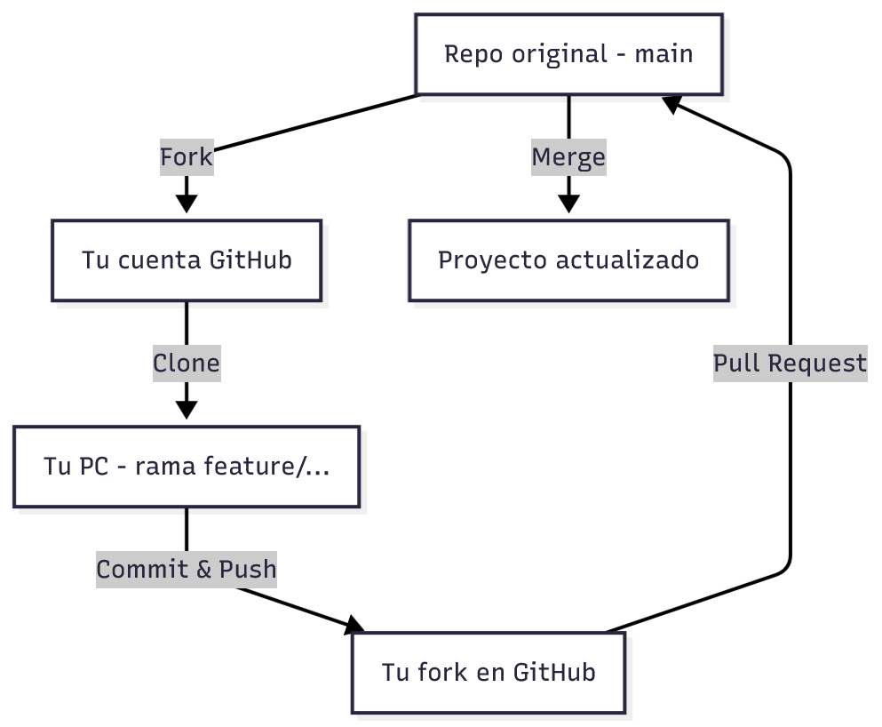

# 🌿 Flujo de trabajo profesional con Git y GitHub (Git Flow)

> Esta guía amplía lo visto en el **Módulo 1 – Tema 0.1 (Introducción a Git)**.
> El objetivo es aprender a **trabajar en proyectos colaborativos** utilizando un flujo de trabajo real basado en ramas (Git Flow), aportando a proyectos propios o de otros.

---

## 🧠 ¿Qué es Git Flow?

**Git Flow** es una forma organizada de usar Git que define cómo crear, revisar y unir cambios dentro de un proyecto.
Su objetivo es mantener el código **ordenado, colaborativo y sin interrupciones**.

### 🔹 Estructura básica de ramas

```
main (o master)
│
├── develop
│   ├── feature/nueva-funcion
│   ├── fix/arreglo-bug
│   ├── doc/actualiza-readme
│
└── release / hotfix
```

- **`main`** → rama estable del proyecto (versión en producción).
- **`develop`** → rama de desarrollo (versión en curso).
- **`feature/*`** → nuevas funcionalidades.
- **`fix/*`** → correcciones o parches.
- **`hotfix/*`** → arreglos urgentes sobre `main`.
- **`release/*`** → preparación para nuevas versiones.

> 💡 En proyectos educativos o pequeños, podés usar solo `main` y ramas de `feature/` para simplificar.

---

## 🍴 1. Fork: copiar un proyecto a tu cuenta

Cuando querés **contribuir a un proyecto de otra persona o institución**, primero debés crear tu propia copia (fork) en GitHub.

### Pasos:
1. Ingresá al repositorio original en GitHub.
2. Hacé clic en el botón **“Fork”** (arriba a la derecha).
3. Elegí tu cuenta personal.
4. GitHub creará una **copia del proyecto** en tu perfil.

> 🔗 Ejemplo:
> Original: `github.com/ingenieria/taller-python`
> Tu fork: `github.com/tu-usuario/taller-python`

---

## 🧭 2. Clonar tu fork (descargarlo localmente)

Clonar significa traer el proyecto de GitHub a tu computadora.

```bash
git clone [email protected]:tu-usuario/taller-python.git
cd taller-python
```

> 💡 Consejo: después de clonar, verificá la conexión con:
> ```bash
> git remote -v
> ```

---

## 🌿 3. Crear una nueva rama de trabajo

Nunca trabajes directamente en `main`.
En su lugar, creá una rama con un nombre descriptivo.

```bash
git checkout -b feature/nueva-funcion
```

Esto crea una nueva rama **y te cambia automáticamente a ella**.

> 🧩 Ejemplos de nombres de ramas:
> - `feature/mejora-notebook`
> - `fix/error-importacion`
> - `doc/actualiza-readme`

---

## 💾 4. Hacer commits con mensajes claros

Cada conjunto de cambios debe registrarse con un **commit**.

```bash
git add .
git commit -m "Agrega función para calcular promedios"
```

> 💬 *Buenas prácticas:*
> - Mensajes cortos y en modo imperativo (“Agrega”, “Corrige”, “Implementa”).
> - Agrupar commits por tipo de cambio (no guardar todo junto).

---

## ⬆️ 5. Subir tus cambios (push)

Enviá tu nueva rama a GitHub para que otros puedan verla.

```bash
git push origin feature/nueva-funcion
```

> Esto creará la rama también en GitHub.

---

## 🔄 6. Mantener tu fork actualizado

Antes de enviar tus cambios, asegurate de tener el proyecto **sincronizado** con el repositorio original.

### Paso 1: agregar el remoto “upstream”
```bash
git remote add upstream [email protected]:ingenieria/taller-python.git
```

### Paso 2: traer los últimos cambios
```bash
git fetch upstream
```

### Paso 3: actualizar tu rama `main`
```bash
git checkout main
git merge upstream/main
git push origin main
```

> 💡 Esto garantiza que tu versión tenga las últimas actualizaciones del proyecto original.

---

## 📬 7. Crear un Pull Request (PR)

Una vez que tus cambios estén listos y subidos, abrí un **Pull Request (PR)** para proponer que se integren en el proyecto principal.

### Pasos:
1. En tu repositorio fork, hacé clic en **“Compare & pull request”**.
2. Verificá que la comparación sea:
   `base repository: ingenieria/taller-python` ← `head repository: tu-usuario/taller-python`
3. Escribí un título y descripción del cambio (breve, clara y con contexto).
4. Clic en **“Create Pull Request”**.

> 🧠 *Tip:* si el PR resuelve un issue existente, mencioná el número:
> `"Fixes #12"` → GitHub lo cerrará automáticamente al hacer merge.

---

## 🔀 8. Merge: unir los cambios

El **merge** combina el contenido de dos ramas.

- Si tenés permisos, podés hacer el merge directamente desde GitHub.
- Si no, el mantenedor revisará tu PR, podrá pedir ajustes, y luego lo integrará.

### Merge local (ejemplo)
```bash
git checkout main
git pull origin main
git merge feature/nueva-funcion
git push origin main
```

> 💡 Si hay conflictos, Git marcará las diferencias dentro de los archivos (`<<<<<<< HEAD`, `=======`, `>>>>>>>`).
> Debés resolverlos manualmente y luego ejecutar:
> ```bash
> git add .
> git commit -m "Resuelve conflictos de merge"
> ```

---

## 👥 9. Contribuir a otros proyectos (workflow completo)

Ejemplo práctico para colaborar en un proyecto ajeno:

```bash
# 1️⃣ Fork del repo original en GitHub
# 2️⃣ Clonar tu fork
git clone [email protected]:tu-usuario/proyecto.git

# 3️⃣ Crear rama
git checkout -b feature/nueva-funcion

# 4️⃣ Editar archivos y hacer commit
git add .
git commit -m "Agrega nueva función"

# 5️⃣ Subir tu rama al fork
git push origin feature/nueva-funcion

# 6️⃣ Abrir Pull Request en GitHub
# (desde tu fork hacia el repo original)
```

---

## 🌐 10. Estructura visual del flujo (resumen)



```mermaid
flowchart TD
    A[Repo original (main)] -->|Fork| B[Tu cuenta GitHub]
    B -->|Clone| C[Tu PC (rama feature/...)]
    C -->|Commit & Push| D[Tu fork en GitHub]
    D -->|Pull Request| A
    A -->|Merge| E[Proyecto actualizado]
```

---

## ✅ Buenas prácticas de Git Flow

| Situación | Acción recomendada |
|------------|--------------------|
| Antes de empezar | `git pull origin main` o `git fetch upstream` |
| Al desarrollar algo nuevo | Crear una rama (`git checkout -b feature/...`) |
| Al subir cambios | Hacer commits pequeños y descriptivos |
| Antes de abrir un PR | Actualizar tu rama con `main` |
| Después del merge | Eliminar ramas viejas (`git branch -d feature/...`) |

---

## 📚 Recursos recomendados

- [Guía oficial de GitHub – Pull Requests](https://docs.github.com/es/pull-requests/collaborating-with-pull-requests)
- [Git Flow – Atlassian Tutorial](https://www.atlassian.com/git/tutorials/comparing-workflows/gitflow-workflow)
- [Git Branching – Juego interactivo](https://learngitbranching.js.org/?locale=es_ES)
- [Pro Git (Libro gratuito)](https://git-scm.com/book/es/v2)
- [Cheat Sheet oficial de GitHub Education](https://education.github.com/git-cheat-sheet-education.pdf)

---

> 🧭 **Resumen final:**
> Git Flow organiza el trabajo colaborativo.
> Usando ramas y PRs, los proyectos crecen de forma ordenada, con trazabilidad y seguridad en los cambios.

---

