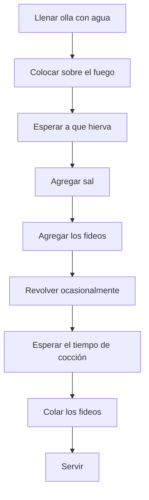

# 🧩 Módulo 4: Estructuras de Datos y Algoritmos Básicos

## **Tema 4.5: Algoritmos Fundamentales (Búsqueda y Ordenamiento)**

---

### 🧠 Introducción

Los **algoritmos fundamentales** constituyen la base del pensamiento computacional y de la eficiencia en la programación.
Entre ellos, los algoritmos de **búsqueda** y **ordenamiento** son esenciales para el manejo eficiente de datos en estructuras como listas, arreglos o colecciones.

Antes de abordarlos, veamos qué entendemos por **algoritmo**.

---

## 🔹 0. ¿Qué es un algoritmo?

Un **algoritmo** es un **conjunto finito de pasos definidos y ordenados** que permiten resolver un problema o realizar una tarea específica.
Cada paso describe **una acción concreta**, y su ejecución debe conducir a un resultado en un tiempo finito.

En otras palabras, un algoritmo es una **receta o procedimiento** que, aplicado a una entrada (datos), produce una salida (resultado).

---

### 📘 Ejemplo cotidiano: cocinar fideos

**Algoritmo en lenguaje natural:**
1. Llenar una olla con agua.
2. Colocar la olla sobre el fuego.
3. Esperar a que el agua hierva.
4. Agregar sal al agua.
5. Incorporar los fideos.
6. Revolver ocasionalmente.
7. Esperar el tiempo de cocción indicado.
8. Colar los fideos.
9. Servir.

✅ Este es un ejemplo de algoritmo **determinístico y secuencial**: cada paso depende del anterior y tiene un orden definido.

---

### 🧩 Representación gráfica del algoritmo



---

## 🔹 1. Búsqueda en estructuras de datos

El objetivo de un algoritmo de búsqueda es **encontrar un elemento dentro de una colección** (lista, arreglo, etc.), o determinar que no existe.

---

### 📘 1.1. Búsqueda lineal

La **búsqueda lineal** recorre todos los elementos de la lista **uno por uno** hasta encontrar el valor buscado.

✅ **Ventaja:** funciona en listas no ordenadas.
⚠️ **Desventaja:** lenta para listas grandes.

```python
def busqueda_lineal(lista, valor):
    for i in range(len(lista)):
        if lista[i] == valor:
            return i  # Devuelve el índice
    return -1  # No encontrado

datos = [10, 20, 30, 40, 50]
print(busqueda_lineal(datos, 30))  # 2
print(busqueda_lineal(datos, 99))  # -1
```

📈 **Complejidad:**
- Peor caso: O(n)
- Mejor caso: O(1)
- Promedio: O(n/2)

---

### 📘 1.2. Búsqueda binaria

La **búsqueda binaria** funciona **solo en listas ordenadas**.
Divide el rango de búsqueda a la mitad en cada paso, descartando la mitad que no contiene el valor.

✅ **Ventaja:** mucho más rápida que la búsqueda lineal.
⚠️ **Desventaja:** requiere una lista previamente ordenada.

```python
def busqueda_binaria(lista, valor):
    inicio = 0
    fin = len(lista) - 1

    while inicio <= fin:
        medio = (inicio + fin) // 2
        if lista[medio] == valor:
            return medio
        elif lista[medio] < valor:
            inicio = medio + 1
        else:
            fin = medio - 1
    return -1

datos = [10, 20, 30, 40, 50, 60, 70]
print(busqueda_binaria(datos, 40))  # 3
print(busqueda_binaria(datos, 15))  # -1
```

📈 **Complejidad:**
- Peor caso: O(log n)
- Mejor caso: O(1)
- Promedio: O(log n)

---

## 🔹 2. Algoritmos de ordenamiento

El **ordenamiento** permite organizar los elementos de una colección según algún criterio (numérico, alfabético, etc.).
Existen muchos métodos, cada uno con diferentes características y eficiencias.

---

### 📘 2.1. Ordenamiento por burbuja (Bubble Sort)

Compara pares de elementos adyacentes e intercambia sus posiciones si están en el orden incorrecto.
Este proceso se repite hasta que toda la lista esté ordenada.

```python
def bubble_sort(lista):
    n = len(lista)
    for i in range(n - 1):
        for j in range(n - i - 1):
            if lista[j] > lista[j + 1]:
                lista[j], lista[j + 1] = lista[j + 1], lista[j]
    return lista

print(bubble_sort([5, 3, 8, 1, 2]))  # [1, 2, 3, 5, 8]
```

📈 **Complejidad:** O(n²)

---

### 📘 2.2. Ordenamiento por selección (Selection Sort)

Encuentra el **menor elemento** en cada pasada y lo coloca en su posición correcta.

```python
def selection_sort(lista):
    n = len(lista)
    for i in range(n):
        minimo = i
        for j in range(i + 1, n):
            if lista[j] < lista[minimo]:
                minimo = j
        lista[i], lista[minimo] = lista[minimo], lista[i]
    return lista

print(selection_sort([5, 3, 8, 1, 2]))  # [1, 2, 3, 5, 8]
```

📈 **Complejidad:** O(n²)

---

### 📘 2.3. Ordenamiento por inserción (Insertion Sort)

Va insertando cada elemento en la posición correcta respecto a los anteriores (como ordenar cartas en la mano).

```python
def insertion_sort(lista):
    for i in range(1, len(lista)):
        valor_actual = lista[i]
        j = i - 1
        while j >= 0 and lista[j] > valor_actual:
            lista[j + 1] = lista[j]
            j -= 1
        lista[j + 1] = valor_actual
    return lista

print(insertion_sort([5, 3, 8, 1, 2]))  # [1, 2, 3, 5, 8]
```

📈 **Complejidad:**
- Peor caso: O(n²)
- Mejor caso: O(n)

---

### 📘 2.4. QuickSort (Ordenamiento rápido)

Divide la lista en dos sublistas: elementos **menores** y **mayores** que un pivote.
Luego ordena recursivamente ambas partes.

```python
def quicksort(lista):
    if len(lista) <= 1:
        return lista
    pivote = lista[len(lista) // 2]
    menores = [x for x in lista if x < pivote]
    iguales = [x for x in lista if x == pivote]
    mayores = [x for x in lista if x > pivote]
    return quicksort(menores) + iguales + quicksort(mayores)

print(quicksort([5, 3, 8, 1, 2, 7, 4]))  # [1, 2, 3, 4, 5, 7, 8]
```

📈 **Complejidad:**
- Promedio: O(n log n)
- Peor caso: O(n²)

---

## 🔹 3. Comparación general de algoritmos de ordenamiento

| Algoritmo | Tipo | Complejidad promedio | Estable | In-place | Ideal para |
|------------|-------|---------------------|----------|-----------|-------------|
| **Burbuja** | Comparativo | O(n²) | ✅ | ✅ | Educación, ejemplos simples |
| **Selección** | Comparativo | O(n²) | ❌ | ✅ | Listas pequeñas |
| **Inserción** | Comparativo | O(n²) | ✅ | ✅ | Listas casi ordenadas |
| **QuickSort** | Divide y vencerás | O(n log n) | ❌ | ❌ | Grandes volúmenes de datos |
| **MergeSort** | Divide y vencerás | O(n log n) | ✅ | ❌ | Listas grandes, estabilidad garantizada |

---

## 🔹 4. Ejemplo integrador: búsqueda y ordenamiento

```python
def quicksort(lista):
    if len(lista) <= 1:
        return lista
    pivote = lista[len(lista)//2]
    menores = [x for x in lista if x < pivote]
    iguales = [x for x in lista if x == pivote]
    mayores = [x for x in lista if x > pivote]
    return quicksort(menores) + iguales + quicksort(mayores)

def busqueda_binaria(lista, valor):
    inicio, fin = 0, len(lista) - 1
    while inicio <= fin:
        medio = (inicio + fin) // 2
        if lista[medio] == valor:
            return medio
        elif lista[medio] < valor:
            inicio = medio + 1
        else:
            fin = medio - 1
    return -1

datos = [9, 1, 7, 3, 2, 8, 4, 5, 6]
ordenados = quicksort(datos)
print("Lista ordenada:", ordenados)

indice = busqueda_binaria(ordenados, 7)
print("Elemento 7 encontrado en posición:", indice)
```

📤 **Salida esperada:**
```
Lista ordenada: [1, 2, 3, 4, 5, 6, 7, 8, 9]
Elemento 7 encontrado en posición: 6
```

---

## 🔹 5. Otros algoritmos útiles y conocidos

| Algoritmo | Descripción | Aplicaciones típicas |
|------------|-------------|----------------------|
| **Merge Sort** | Divide la lista y combina resultados ordenados | Ordenamiento eficiente y estable |
| **Heap Sort** | Utiliza una estructura heap para ordenar | Sistemas de prioridad, planificación |
| **Counting Sort** | Ordenamiento por conteo, sin comparaciones | Datos enteros limitados (por rango) |
| **Dijkstra** | Encuentra caminos más cortos en un grafo | Navegación, redes, logística |
| **A*** | Variante heurística de Dijkstra | Inteligencia artificial, juegos |
| **Kruskal / Prim** | Encuentran árboles de expansión mínima | Redes eléctricas, telecomunicaciones |
| **BFS (Breadth First Search)** | Recorre grafos por niveles | Rutas más cortas sin pesos |
| **DFS (Depth First Search)** | Recorre grafos en profundidad | Exploración, análisis estructural |
| **Binary Search Tree (BST)** | Estructura de búsqueda ordenada | Indexación, bases de datos |
| **Dynamic Programming** | Divide problemas en subproblemas optimizados | Optimización, IA, economía, bioinformática |

---

## 📖 Recursos y referencias

- Cormen, T. H. et al. (2009). *Introduction to Algorithms*. MIT Press.
- Goodrich, M. T. & Tamassia, R. (2015). *Data Structures and Algorithms in Python*. Wiley.
- Downey, A. (2015). *Think Python*. Green Tea Press.
- Real Python – [https://realpython.com/sorting-algorithms-python/](https://realpython.com/sorting-algorithms-python/)
- Python Official Docs – [https://docs.python.org/3/howto/sorting.html](https://docs.python.org/3/howto/sorting.html)

---
