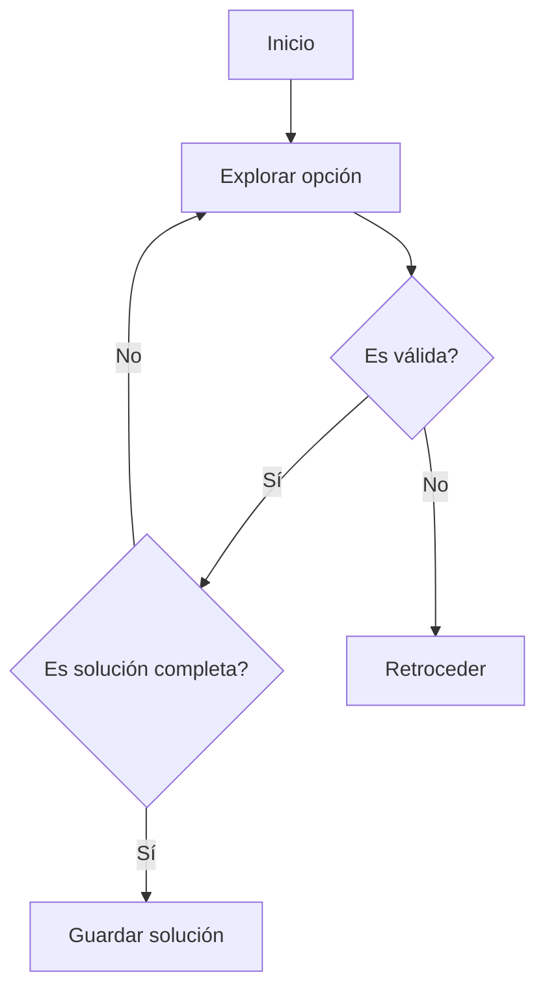
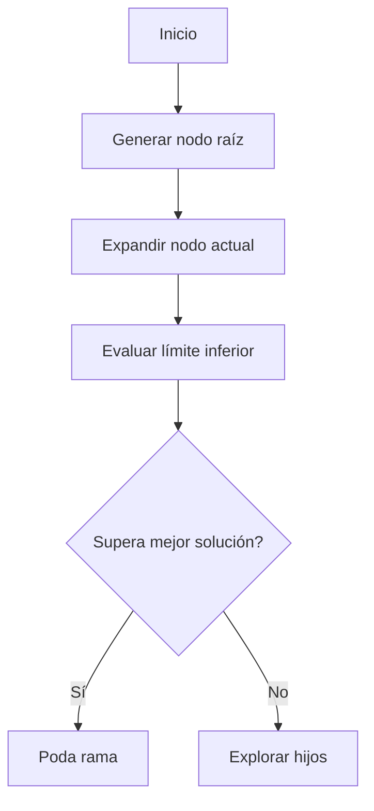
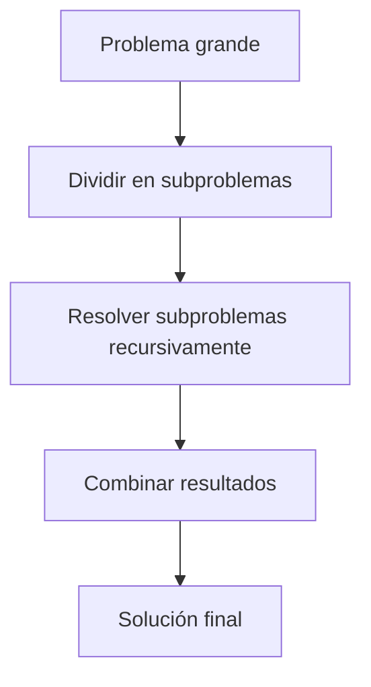
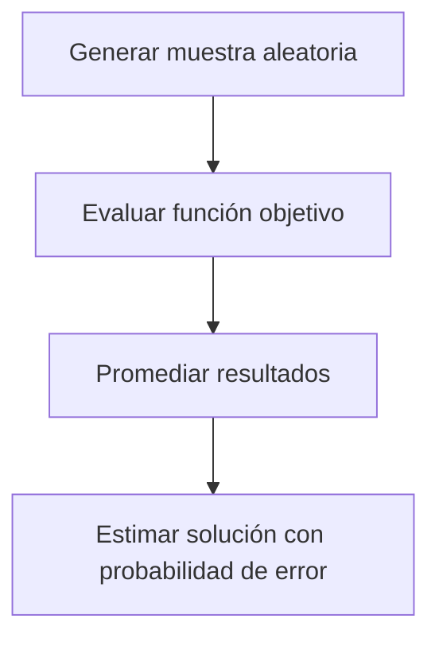

# 🧩 Módulo 4: Estructuras de Datos y Algoritmos Básicos
## **Sección 0: Algoritmos Teóricos y Complejidad**

---

### 🧠 Introducción General

La **teoría de la complejidad algorítmica** estudia cuán eficiente es un algoritmo en términos de **tiempo de ejecución** y **uso de memoria**.
Permite comparar estrategias de resolución y estimar su escalabilidad al crecer el tamaño de los datos.

---

## 🔹 0.1. Complejidad Algorítmica (Big O, Ω, Θ)

**Objetivo / Aplicación:**
Describir el comportamiento asintótico de un algoritmo según el tamaño de entrada `n`.

- **O (Big O):** cota superior (peor caso).
- **Ω (Omega):** cota inferior (mejor caso).
- **Θ (Theta):** cota ajustada (caso promedio).

| Complejidad | Ejemplo típico | Descripción |
|--------------|----------------|--------------|
| O(1) | Acceso en arreglo | Tiempo constante |
| O(log n) | Búsqueda binaria | Crece lentamente |
| O(n) | Recorrido de lista | Lineal |
| O(n log n) | MergeSort | Eficiente |
| O(n²) | BubbleSort | Cuadrática |
| O(2ⁿ) | Backtracking | Exponencial |

```mermaid
graph LR
A[Entrada pequeña] -->|O(n)| B[Crecimiento lineal]
A -->|O(n²)| C[Crecimiento cuadrático]
A -->|O(2ⁿ)| D[Crecimiento exponencial]
```

```python
import time

def ejemplo_complejidad(n):
    start = time.time()
    total = sum(i for i in range(n))
    print("Tiempo:", round(time.time()-start,6), "seg")
ejemplo_complejidad(10**6)
```

---

## 🔹 0.2. Backtracking (Búsqueda Exhaustiva con Retroceso)

**Objetivo / Aplicación:**
Resolver problemas combinatorios explorando todas las posibilidades, **retrocediendo** cuando una solución parcial no puede completarse.

**Fundamento teórico:**
Construye soluciones paso a paso y retrocede al detectar inconsistencias.
**Complejidad:** Exponencial en el peor caso O(kⁿ) · **Clasificación:** Exacto / Determinístico
**Ejemplo:** Sudoku, N-reinas, combinaciones válidas.



```python
def backtrack(sol, nums):
    if len(sol) == len(nums):
        print(sol)
        return
    for n in nums:
        if n not in sol:
            backtrack(sol + [n], nums)

backtrack([], [1,2,3])
```

---

## 🔹 0.3. Branch and Bound (Ramificación y Poda)

**Objetivo / Aplicación:**
Optimizar la búsqueda de soluciones descartando ramas que no pueden mejorar la mejor solución actual.
Muy usado en **optimización combinatoria** (p. ej., problema del viajante).

**Fundamento teórico:**
Expande ramas del árbol de búsqueda y las **poda** si superan un límite conocido (bound).
**Complejidad:** Exponencial en general · **Clasificación:** Exacto / Optimización
**Origen:** **Little, Murty, Sweeney y Karel (1963)**.



```python
def branch_and_bound(nodos, mejor=float("inf")):
    for nodo in nodos:
        if nodo >= mejor:
            continue
        if nodo == 7:
            mejor = min(mejor, nodo)
        else:
            mejor = branch_and_bound([nodo+1, nodo+2], mejor)
    return mejor

print("Mejor valor encontrado:", branch_and_bound([0]))
```

---

## 🔹 0.4. Programación Dinámica

**Objetivo / Aplicación:**
Dividir un problema en **subproblemas solapados**, resolviendo cada uno una vez y reutilizando sus resultados.
Se aplica en optimización, secuencias, rutas, etc.

**Fundamento teórico:**
Basado en la **recurrencia** y **memorización** de soluciones parciales.
**Complejidad:** O(n·m) · **Clasificación:** Determinístico / Optimización / Recursivo
**Origen:** **Richard Bellman (1950s)**.

```mermaid
flowchart TD
A[Problema grande] --> B[Dividir en subproblemas]
B --> C[Resolver subproblemas menores]
C --> D[Almacenar resultados (memo)]
D --> E[Combinar resultados parciales]
```

### Ejemplo: Fibonacci con memorización

```python
memo = {}
def fib(n):
    if n in memo:
        return memo[n]
    if n <= 1:
        return n
    memo[n] = fib(n-1) + fib(n-2)
    return memo[n]

print("Fibonacci(10) =", fib(10))
```

---

### Ejemplo: Problema de la Mochila (0/1 Knapsack)

```python
def knapsack(pesos, valores, W):
    n = len(pesos)
    dp = [[0]*(W+1) for _ in range(n+1)]
    for i in range(1,n+1):
        for w in range(W+1):
            if pesos[i-1] <= w:
                dp[i][w] = max(dp[i-1][w], valores[i-1]+dp[i-1][w-pesos[i-1]])
            else:
                dp[i][w] = dp[i-1][w]
    return dp[n][W]

print("Valor máximo:", knapsack([2,3,4],[4,5,6],5))
```

---

## 🔹 0.5. Divide y Vencerás

**Objetivo / Aplicación:**
Resolver un problema grande dividiéndolo en **subproblemas independientes**, resolviéndolos y combinando los resultados.

**Fundamento teórico:**
Divide → Resuelve → Combina.
Ejemplos: MergeSort, QuickSort, FFT.
**Complejidad:** O(n log n) (en casos balanceados) · **Clasificación:** Recursivo / Determinístico



```python
def merge_sort(arr):
    if len(arr) <= 1: return arr
    mid = len(arr)//2
    izq = merge_sort(arr[:mid])
    der = merge_sort(arr[mid:])
    return sorted(izq + der)

print(merge_sort([5,3,8,1,2]))
```

---

## 🔹 0.6. Algoritmos Probabilísticos (Monte Carlo / Las Vegas)

**Objetivo / Aplicación:**
Resolver problemas complejos mediante **aleatoriedad controlada**.
- **Monte Carlo:** puede devolver respuestas incorrectas, pero rápido.
- **Las Vegas:** siempre correcto, pero tiempo variable.

**Fundamento teórico:**
Basados en **probabilidad y simulación** (p. ej., integración, optimización, juegos).
**Complejidad:** Depende de distribución aleatoria · **Clasificación:** Probabilístico / Aproximado



### Ejemplo Monte Carlo: estimar π

```python
import random, math

def montecarlo_pi(n=10000):
    dentro = 0
    for _ in range(n):
        x,y = random.random(), random.random()
        if x*x + y*y <= 1:
            dentro += 1
    return 4*dentro/n

print("Estimación de π:", montecarlo_pi())
```

---

### ✅ Cierre de la Sección 10

Los **algoritmos teóricos** constituyen la base del pensamiento algorítmico moderno:
- **Backtracking / Branch & Bound:** búsqueda exhaustiva y optimización.
- **Programación Dinámica:** reutilización eficiente.
- **Divide & Vencerás:** resolución modular.
- **Probabilísticos:** soluciones rápidas con incertidumbre controlada.

La **teoría de la complejidad** permite entender sus límites y elegir la estrategia más adecuada para cada tipo de problema.

---
