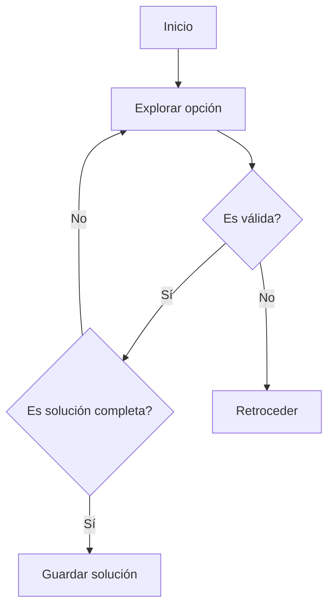
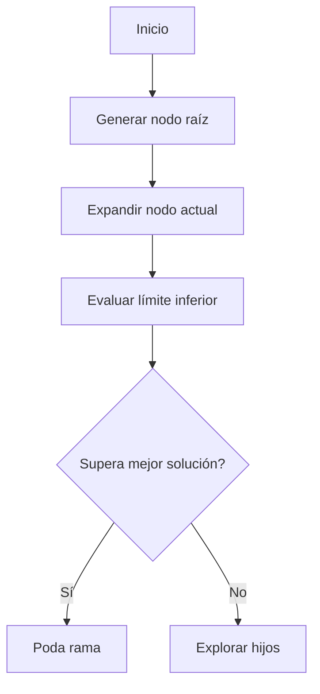
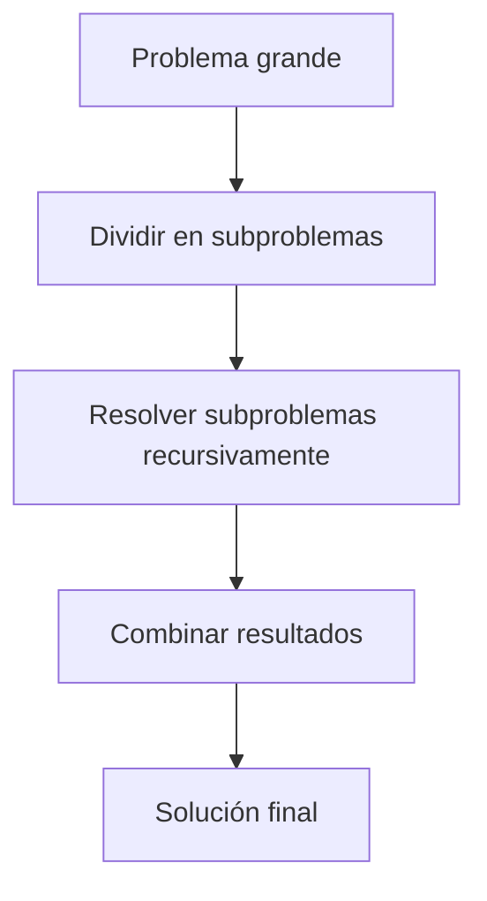
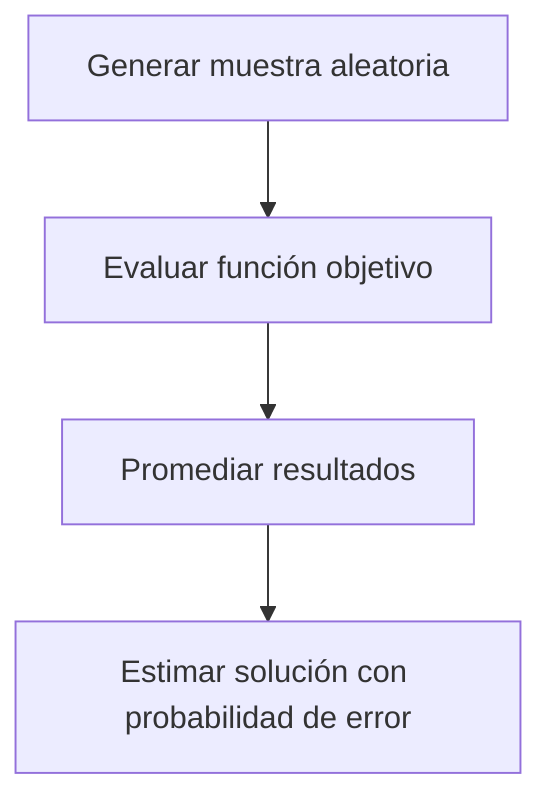

# 🧩 Módulo 4: Estructuras de Datos y Algoritmos Básicos
## **Sección 0: Algoritmos Teóricos y Complejidad**

---

### 🧠 Introducción General

La **teoría de la complejidad algorítmica** estudia cuán eficiente es un algoritmo en términos de **tiempo de ejecución** y **uso de memoria**.
Permite comparar estrategias de resolución y estimar su escalabilidad al crecer el tamaño de los datos.

---

## 🔹 0.1. Complejidad Algorítmica (Big O, Ω, Θ)

**Objetivo / Aplicación:**
Describir el comportamiento asintótico de un algoritmo según el tamaño de entrada `n`.

### 📚 Fundamento Teórico

La **notación asintótica** proporciona un lenguaje matemático formal para describir el crecimiento de funciones que representan el comportamiento de algoritmos. Este análisis se centra en el comportamiento cuando el tamaño de entrada tiende al infinito, ignorando constantes multiplicativas y términos de menor orden.

#### Definiciones Formales:

**1. Big O (O) - Cota Superior Asintótica:**
Formalmente, decimos que $f(n) = O(g(n))$ si existen constantes positivas $c$ y $n₀$ tales que:
```
0 ≤ f(n) ≤ c·g(n) para todo n ≥ n₀
```
Esto significa que g(n) es una **cota superior** del crecimiento de f(n), representando el **peor caso** del algoritmo.

**2. Big Omega (Ω) - Cota Inferior Asintótica:**
Decimos que $f(n) = Ω(g(n))$ si existen constantes positivas $c$ y $n₀$ tales que:
```
0 ≤ c·g(n) ≤ f(n) para todo n ≥ n₀
```
$g(n)$ es una **cota inferior** del crecimiento de $f(n)$, representando el **mejor caso** del algoritmo.

**3. Theta (Θ) - Cota Ajustada:**
Decimos que $f(n) = Θ(g(n))$ si existen constantes positivas $c₁$, $c₂$ y $n₀$ tales que:
```
0 ≤ c₁·g(n) ≤ f(n) ≤ c₂·g(n) para todo n ≥ n₀
```
$f(n)$ crece al **mismo ritmo** que $g(n)$, representando el **caso promedio** ajustado.

#### Propiedades Fundamentales:

- **Transitividad:** Si $f(n) = O(g(n))$ y $g(n) = O(h(n))$, entonces $f(n) = O(h(n))$
- **Reflexividad:** $f(n) = O(f(n))$
- **Simetría (para Θ):** Si $f(n) = Θ(g(n))$, entonces $g(n) = Θ(f(n))$
- **Relación entre notaciones:** $f(n) = Θ(g(n)) ⟺ f(n) = O(g(n))$ y $f(n) = Ω(g(n))$

#### Jerarquía de Complejidades:

```
O(1) < O(log log n) < O(log n) < O(√n) < O(n) < O(n log n) <
O(n²) < O(n³) < O(2ⁿ) < O(n!) < O(nⁿ)
```

**Implicaciones Prácticas:**
- Algoritmos $O(1)$ y $O(log n)$: escalan excelentemente
- $O(n)$ y $O(n log n)$: aceptables para grandes volúmenes
- $O(n²)$ y $O(n³)$: problemáticos con datos masivos
- $O(2ⁿ)$ y $O(n!)$: solo viables para entradas pequeñas

#### Análisis de Complejidad Espacial:

Además del tiempo, analizamos el **espacio** (memoria) que requiere un algoritmo:
- **In-place:** $O(1)$ espacio adicional (modifica estructura original)
- **Recursión:** $O(h)$ donde h es la altura de recursión
- **Memorización:** Espacio proporcional a subproblemas únicos

- **O (Big O):** cota superior (peor caso).
- **Ω (Omega):** cota inferior (mejor caso).
- **Θ (Theta):** cota ajustada (caso promedio).

| Complejidad | Ejemplo típico | Descripción |
|--------------|----------------|--------------|
| O(1) | Acceso en arreglo | Tiempo constante |
| O(log n) | Búsqueda binaria | Crece lentamente |
| O(n) | Recorrido de lista | Lineal |
| O(n log n) | MergeSort | Eficiente |
| O(n²) | BubbleSort | Cuadrática |
| O(2ⁿ) | Backtracking | Exponencial |

```mermaid
graph LR
A[Entrada pequeña] -->|O(n)| B[Crecimiento lineal]
A -->|O(n²)| C[Crecimiento cuadrático]
A -->|O(2ⁿ)| D[Crecimiento exponencial]
```

```python
import time

def ejemplo_complejidad(n):
    start = time.time()
    total = sum(i for i in range(n))
    print("Tiempo:", round(time.time()-start,6), "seg")
ejemplo_complejidad(10**6)
```

---

## 🔹 0.2. Backtracking (Búsqueda Exhaustiva con Retroceso)

**Objetivo / Aplicación:**
Resolver problemas combinatorios explorando todas las posibilidades, **retrocediendo** cuando una solución parcial no puede completarse.

### 📚 Fundamento Teórico

**Backtracking** es una técnica algorítmica de **búsqueda exhaustiva sistemática** que construye soluciones candidatas de forma incremental y abandona una candidata ("retrocede") tan pronto como determina que no puede conducir a una solución válida.

#### Principios Fundamentales:

**1. Espacio de Búsqueda como Árbol:**
El backtracking modela el problema como un **árbol de decisiones** donde:
- Cada **nodo** representa una decisión o elección parcial
- Cada **rama** representa una opción disponible
- Las **hojas** son soluciones completas (válidas o inválidas)

**2. Construcción Incremental:**
La solución se construye paso a paso, agregando elementos uno a la vez:
```
Estado actual → Elegir candidato → Validar → Continuar o Retroceder
```

**3. Poda del Espacio de Búsqueda:**
Se utilizan **restricciones** para eliminar ramas que no pueden conducir a soluciones:
- **Explícitas:** condiciones que debe cumplir toda solución
- **Implícitas:** restricciones derivadas del contexto del problema

#### Estructura General del Algoritmo:

```
function BACKTRACK(solución_parcial):
    if es_solución_completa(solución_parcial):
        procesar_solución(solución_parcial)
        return

    for candidato in generar_candidatos(solución_parcial):
        if es_válido(candidato, solución_parcial):
            agregar(candidato, solución_parcial)
            BACKTRACK(solución_parcial)
            remover(candidato, solución_parcial)  # RETROCEDER
```

#### Análisis de Complejidad:

**Temporal:**
- **Peor caso:** O(b^d) donde:
  - b = factor de ramificación (opciones por nivel)
  - d = profundidad del árbol (tamaño de la solución)
- Para permutaciones: O(n!)
- Para subconjuntos: O(2ⁿ)

**Espacial:**
- O(d) para la pila de recursión
- O(n) adicional para la solución en construcción

#### Optimizaciones Comunes:

1. **Ordenamiento de Candidatos:** Elegir primero los más prometedores
2. **Detección Temprana:** Identificar soluciones inválidas lo antes posible
3. **Memorización:** Evitar explorar estados ya visitados
4. **Heurísticas:** Guiar la búsqueda con información del dominio

#### Aplicaciones Clásicas:

- **N-Reinas:** Colocar N reinas en tablero N×N sin que se ataquen
- **Sudoku:** Completar cuadrícula con restricciones de fila/columna/región
- **Laberinto:** Encontrar caminos desde origen a destino
- **Coloreado de Grafos:** Asignar colores a nodos sin adyacentes iguales
- **Generación de Combinaciones/Permutaciones:** Todos los ordenamientos posibles

**Complejidad:** Exponencial en el peor caso O(kⁿ) · **Clasificación:** Exacto / Determinístico
**Ejemplo:** Sudoku, N-reinas, combinaciones válidas.



```python
def backtrack(sol, nums):
    if len(sol) == len(nums):
        print(sol)
        return
    for n in nums:
        if n not in sol:
            backtrack(sol + [n], nums)

backtrack([], [1,2,3])
```

---

## 🔹 0.3. Branch and Bound (Ramificación y Poda)

**Objetivo / Aplicación:**
Optimizar la búsqueda de soluciones descartando ramas que no pueden mejorar la mejor solución actual.
Muy usado en **optimización combinatoria** (p. ej., problema del viajante).

### 📚 Fundamento Teórico

**Branch and Bound** es una técnica algorítmica para resolver **problemas de optimización** (minimización o maximización) que combina búsqueda exhaustiva con **poda inteligente** basada en cotas (bounds).

#### Principios Fundamentales:

**1. Ramificación (Branching):**
- Divide el espacio de soluciones en **subproblemas más pequeños**
- Construye un **árbol de exploración** similar a backtracking
- Cada nodo representa un subproblema con restricciones adicionales

**2. Acotación (Bounding):**
- Calcula una **cota** (límite superior o inferior) para cada subproblema
- **Lower bound (LB):** estimación optimista del mejor valor alcanzable
- **Upper bound (UB):** mejor solución completa encontrada hasta el momento

**3. Poda (Pruning):**
- Si LB de un nodo ≥ UB actual → **podar** esa rama (no puede mejorar)
- Reduce drásticamente el espacio de búsqueda sin perder optimalidad

#### Componentes Esenciales:

**a) Estrategia de Selección de Nodos:**
- **FIFO (Breadth-First):** Explora por niveles
- **LIFO (Depth-First):** Profundiza primero
- **Best-First:** Elige el nodo con mejor cota
- **Least-Cost:** Prioriza según función heurística

**b) Función de Acotación:**
- Debe ser **admisible:** nunca sobreestimar (minimización) o subestimar (maximización)
- Debe ser **eficiente de calcular**
- Mejor cota → más poda → menos exploración

**c) Solución Incumbente:**
- Mejor solución **completa** encontrada hasta el momento
- Se actualiza cuando se encuentra una mejor solución factible
- Sirve como **upper bound** para poda

#### Algoritmo General:

```
function BRANCH_AND_BOUND(problema):
    mejor_solución = ∞ (minimización) o -∞ (maximización)
    cola_prioridad = [nodo_raíz]
    
    while cola_prioridad no vacía:
        nodo = extraer_mejor(cola_prioridad)
        
        if cota(nodo) ≥ mejor_solución:  # Poda
            continue
        
        if es_solución_completa(nodo):
            if valor(nodo) < mejor_solución:
                mejor_solución = valor(nodo)
        else:
            for hijo in ramificar(nodo):
                if cota(hijo) < mejor_solución:
                    insertar(cola_prioridad, hijo)
    
    return mejor_solución
```

#### Análisis de Complejidad:

**Temporal:**
- **Peor caso:** O(b^d) exponencial (sin poda efectiva)
- **Caso promedio:** Depende significativamente de la calidad de las cotas
- Poda efectiva puede reducir a O(n²) o O(n³) en problemas específicos

**Espacial:**
- O(b·d) para almacenar nodos en cola de prioridad
- Puede ser prohibitivo en problemas grandes

#### Diferencias con Backtracking:

| Aspecto | Backtracking | Branch and Bound |
|---------|--------------|------------------|
| Objetivo | Encontrar **todas** las soluciones o una válida | Encontrar la **óptima** |
| Decisión de poda | Restricciones de validez | Cotas de optimización |
| Complejidad | O(b^d) sin optimización | Varía según calidad de cotas |
| Uso de memoria | Menor (DFS recursivo) | Mayor (cola de nodos) |

#### Aplicaciones Clásicas:

- **Problema del Viajante (TSP):** Encontrar ruta más corta
- **Asignación de Tareas:** Minimizar costo total
- **Problema de la Mochila 0/1:** Maximizar valor con peso limitado
- **Job Scheduling:** Minimizar tiempo de finalización
- **Corte de Materiales:** Minimizar desperdicio

**Complejidad:** Exponencial en general · **Clasificación:** Exacto / Optimización
**Origen:** **Little, Murty, Sweeney y Karel (1963)**.



```python
def branch_and_bound(nodos, mejor=float("inf")):
    for nodo in nodos:
        if nodo >= mejor:
            continue
        if nodo == 7:
            mejor = min(mejor, nodo)
        else:
            mejor = branch_and_bound([nodo+1, nodo+2], mejor)
    return mejor

print("Mejor valor encontrado:", branch_and_bound([0]))
```

---

## 🔹 0.4. Programación Dinámica

**Objetivo / Aplicación:**
Dividir un problema en **subproblemas solapados**, resolviendo cada uno una vez y reutilizando sus resultados.
Se aplica en optimización, secuencias, rutas, etc.

### 📚 Fundamento Teórico

La **Programación Dinámica (DP)** es un paradigma algorítmico que resuelve problemas complejos dividiéndolos en **subproblemas más simples**, almacenando sus soluciones para evitar recalcularlas. Transforma algoritmos exponenciales en polinomiales al eliminar redundancia computacional.

#### Principios Fundamentales:

**1. Subestructura Óptima:**
Un problema tiene subestructura óptima si su **solución óptima** se puede construir eficientemente a partir de las **soluciones óptimas** de sus subproblemas.

**Ejemplo matemático:**
```
Camino más corto: dist(A→C) = dist(A→B) + dist(B→C)
Solo es óptimo si A→B y B→C también son óptimos
```

**2. Subproblemas Solapados:**
Los subproblemas se **repiten múltiples veces** durante la resolución recursiva.
Sin memorización, cada subproblema se resuelve múltiples veces → ineficiencia exponencial.
Con memorización, cada subproblema se resuelve **una sola vez** → eficiencia polinomial.

**Contraste con Divide y Vencerás:**
- **D&C:** Subproblemas **independientes** (no se solapan)
- **DP:** Subproblemas **solapados** (se reutilizan)

#### Enfoques de Implementación:

**1. Top-Down (Memorización):**
- Comienza desde el problema original
- Resuelve recursivamente los subproblemas
- **Almacena** (memoriza) resultados en tabla/diccionario
- Calcula subproblemas **bajo demanda**

```python
def fib_memo(n, memo={}):
    if n in memo:
        return memo[n]  # Ya calculado
    if n <= 1:
        return n
    memo[n] = fib_memo(n-1, memo) + fib_memo(n-2, memo)
    return memo[n]
```

**Ventajas:** Intuitivo, solo calcula lo necesario
**Desventajas:** Overhead de recursión, stack overflow posible

**2. Bottom-Up (Tabulación):**
- Comienza desde los casos base más simples
- Resuelve subproblemas en **orden topológico**
- Construye tabla iterativamente
- Calcula **todos** los subproblemas

```python
def fib_tabular(n):
    dp = [0] * (n+1)
    dp[1] = 1
    for i in range(2, n+1):
        dp[i] = dp[i-1] + dp[i-2]
    return dp[n]
```

**Ventajas:** Más eficiente (sin recursión), predecible
**Desventajas:** Puede calcular subproblemas innecesarios

#### Estructura de la Relación de Recurrencia:

El corazón de DP es la **ecuación de recurrencia** que expresa la solución en función de subproblemas:

```
DP[estado] = función(DP[sub_estado_1], DP[sub_estado_2], ...)
```

**Ejemplo - Fibonacci:**
```
F(n) = F(n-1) + F(n-2)
Base: F(0)=0, F(1)=1
```

**Ejemplo - Mochila 0/1:**
```
DP[i][w] = max(
    DP[i-1][w],              // No tomar item i
    valor[i] + DP[i-1][w-peso[i]]  // Tomar item i
)
```

#### Pasos para Diseñar una Solución DP:

1. **Identificar subproblemas:** ¿Qué estados definen un subproblema?
2. **Definir recurrencia:** ¿Cómo se relacionan los estados?
3. **Establecer casos base:** ¿Cuáles son los subproblemas triviales?
4. **Determinar orden de evaluación:** ¿En qué orden calcular los estados?
5. **Optimizar espacio:** ¿Se pueden descartar estados antiguos?

#### Análisis de Complejidad:

**Temporal:**
- **Fórmula general:** O(#subproblemas × tiempo_por_subproblema)
- **Fibonacci:** O(n) vs O(2ⁿ) recursivo puro
- **Mochila 0/1:** O(n·W) donde n=items, W=capacidad
- **LCS (Longest Common Subsequence):** O(m·n)

**Espacial:**
- **Completo:** O(dimensiones del estado)
- **Optimizado:** A menudo reducible a O(tamaño de una fila/columna)

#### Optimización de Espacio:

Muchos problemas DP solo necesitan **resultados recientes**:

```python
# Espacio O(n)
dp = [0] * n
for i in range(n):
    dp[i] = dp[i-1] + dp[i-2]

# Optimizado a O(1)
prev2, prev1 = 0, 1
for i in range(n):
    current = prev1 + prev2
    prev2, prev1 = prev1, current
```

#### Variantes y Extensiones:

1. **DP con Bitmasking:** Estados representados como bits (Problema del Viajante)
2. **DP en Árboles:** Problemas en estructuras jerárquicas
3. **DP con Optimización Convexa:** Monotonía en decisiones óptimas
4. **DP Probabilística:** Con estados estocásticos

#### Aplicaciones Clásicas:

- **Secuencias:** LCS, LIS (Longest Increasing Subsequence), Edit Distance
- **Caminos:** Matriz de costos mínimos, Floyd-Warshall
- **Optimización:** Mochila, Coin Change, Partición de arrays
- **Juegos:** Nim, Minimax con DP
- **Strings:** Pattern Matching, Expresiones Regulares

**Complejidad:** O(n·m) · **Clasificación:** Determinístico / Optimización / Recursivo
**Origen:** **Richard Bellman (1950s)**.

```mermaid
flowchart TD
A[Problema grande] --> B[Dividir en subproblemas]
B --> C[Resolver subproblemas menores]
C --> D[Almacenar resultados (memo)]
D --> E[Combinar resultados parciales]
```

### Ejemplo: Fibonacci con memorización

```python
memo = {}
def fib(n):
    if n in memo:
        return memo[n]
    if n <= 1:
        return n
    memo[n] = fib(n-1) + fib(n-2)
    return memo[n]

print("Fibonacci(10) =", fib(10))
```

---

### Ejemplo: Problema de la Mochila (0/1 Knapsack)

```python
def knapsack(pesos, valores, W):
    n = len(pesos)
    dp = [[0]*(W+1) for _ in range(n+1)]
    for i in range(1,n+1):
        for w in range(W+1):
            if pesos[i-1] <= w:
                dp[i][w] = max(dp[i-1][w], valores[i-1]+dp[i-1][w-pesos[i-1]])
            else:
                dp[i][w] = dp[i-1][w]
    return dp[n][W]

print("Valor máximo:", knapsack([2,3,4],[4,5,6],5))
```

---

## 🔹 0.5. Divide y Vencerás

**Objetivo / Aplicación:**
Resolver un problema grande dividiéndolo en **subproblemas independientes**, resolviéndolos y combinando los resultados.

### 📚 Fundamento Teórico

**Divide y Vencerás** (Divide and Conquer) es un paradigma algorítmico que descompone un problema en **subproblemas más pequeños del mismo tipo**, los resuelve recursivamente, y luego **combina** sus soluciones para obtener la solución del problema original.

#### Principios Fundamentales:

**1. División (Divide):**
- Descomponer el problema en k **subproblemas más pequeños**
- Los subproblemas son **instancias del mismo problema**
- Típicamente k=2 (división binaria), pero puede variar

**2. Conquista (Conquer):**
- Resolver cada subproblema **recursivamente**
- Si el subproblema es suficientemente pequeño → resolver directamente (caso base)
- Los subproblemas son **independientes** entre sí

**3. Combinación (Combine):**
- **Fusionar** las soluciones de los subproblemas
- Construir la solución del problema original
- Puede ser trivial (MergeSort) o compleja (Strassen)

#### Estructura Recursiva General:

```python
def divide_y_venceras(problema):
    # Caso base
    if es_pequeño(problema):
        return resolver_directamente(problema)
    
    # Dividir
    subproblemas = dividir(problema)
    
    # Conquistar (recursión)
    soluciones_parciales = []
    for subproblema in subproblemas:
        soluciones_parciales.append(divide_y_venceras(subproblema))
    
    # Combinar
    return combinar(soluciones_parciales)
```

#### Análisis de Complejidad mediante Teorema Maestro:

Para recurrencias de la forma:
```
T(n) = a·T(n/b) + f(n)
```
Donde:
- $a$ = número de subproblemas
- $n/b$ = tamaño de cada subproblema
- $f(n)$ = costo de dividir y combinar

**Casos del Teorema Maestro:**

**Caso 1:** Si $f(n) = O(n^c)$ donde $c < log_b(a)$
```
T(n) = Θ(n^(log_b(a)))
```

**Caso 2:** Si $f(n) = Θ(n^c · log^k(n))$ donde $c = log_b(a)$
```
T(n) = Θ(n^c · log^(k+1)(n))
```

**Caso 3:** Si $f(n) = Ω(n^c)$ donde $c > log_b(a)$
```
T(n) = Θ(f(n))
```

#### Ejemplos de Aplicación del Teorema:

**MergeSort:** $T(n) = 2T(n/2) + O(n)$
- $a=2$, $b=2$, $f(n)=n$ → $c=1$, $log₂(2)=1$
- Caso 2: $T(n) = Θ(n log n)$

**Búsqueda Binaria:** $T(n) = T(n/2) + O(1)$
- $a=1$, $b=2$, $f(n)=1$ → $c=0$, $log₂(1)=0$
- Caso 2: $T(n) = Θ(log n)$

**Multiplicación de Karatsuba:** $T(n) = 3T(n/2) + O(n)$
- $a=3$, $b=2$, $f(n)=n$ → $c=1$, $log₂(3)≈1.585$
- Caso 1: $T(n) = Θ(n^1.585)$

#### Diferencias con Programación Dinámica:

| Aspecto | Divide y Vencerás | Programación Dinámica |
|---------|-------------------|----------------------|
| Subproblemas | **Independientes** | **Solapados** |
| Almacenamiento | No necesita memorización | Requiere tabla/memo |
| Recursión | Pura (tree recursion) | Con memorización |
| Ejemplos | MergeSort, QuickSort | Fibonacci, Knapsack |

#### Estrategias de División:

**1. División Balanceada:**
- Dividir en partes **aproximadamente iguales**
- Garantiza profundidad logarítmica
- Ejemplo: MergeSort (n/2, n/2)

**2. División Desbalanceada:**
- Una parte significativamente más grande
- Puede degradar a O(n²)
- Ejemplo: QuickSort con pivote malo

**3. División Múltiple:**
- Más de 2 subproblemas
- Ejemplo: QuickSort con 3 particiones (< pivote, = pivote, > pivote)

#### Optimizaciones Comunes:

**1. Cambio a Algoritmo Simple para Casos Pequeños:**
```python
def merge_sort_optimizado(arr):
    if len(arr) < 10:  # Umbral
        return insertion_sort(arr)  # Más rápido para n pequeño
    # ... continuar con merge sort
```

**2. Reducción de Overhead:**
- Evitar copias innecesarias de arrays
- Usar índices en lugar de subarrays

**3. Paralelización:**
- Los subproblemas independientes se pueden resolver en paralelo
- Ideal para sistemas multi-core

#### Complejidad Espacial:

**Stack de Recursión:**
- Profundidad máxima: O(log n) para división balanceada
- Cada llamada almacena: variables locales + parámetros
- Total: O(log n) espacio de stack

**Memoria Auxiliar:**
- MergeSort: O(n) para array temporal
- QuickSort in-place: O(1) adicional
- Strassen: O(n²) matrices temporales

#### Aplicaciones Clásicas:

**Ordenamiento:**
- MergeSort: O(n log n) garantizado, estable
- QuickSort: O(n log n) promedio, in-place

**Búsqueda:**
- Búsqueda Binaria: O(log n) en arrays ordenados
- Selección del k-ésimo elemento: O(n) promedio

**Geometría Computacional:**
- Par más cercano: O(n log n)
- Envolvente convexa: O(n log n)

**Álgebra:**
- Multiplicación de matrices (Strassen): O(n^2.807)
- FFT (Fast Fourier Transform): O(n log n)
- Multiplicación de enteros grandes (Karatsuba): O(n^1.585)

**Procesamiento:**
- Maximum Subarray (Kadane adaptado): O(n log n)
- Inversiones en arrays: O(n log n)

**Complejidad:** O(n log n) (en casos balanceados) · **Clasificación:** Recursivo / Determinístico



```python
def merge_sort(arr):
    if len(arr) <= 1: return arr
    mid = len(arr)//2
    izq = merge_sort(arr[:mid])
    der = merge_sort(arr[mid:])
    return sorted(izq + der)

print(merge_sort([5,3,8,1,2]))
```

---

## 🔹 0.6. Algoritmos Probabilísticos (Monte Carlo / Las Vegas)

**Objetivo / Aplicación:**
Resolver problemas complejos mediante **aleatoriedad controlada**.
- **Monte Carlo:** puede devolver respuestas incorrectas, pero rápido.
- **Las Vegas:** siempre correcto, pero tiempo variable.

### 📚 Fundamento Teórico

Los **algoritmos probabilísticos** (o randomizados) utilizan **decisiones aleatorias** durante su ejecución para resolver problemas de forma eficiente. A diferencia de los algoritmos determinísticos, su comportamiento puede variar entre ejecuciones con la misma entrada.

#### Clasificación Principal:

**1. Algoritmos Monte Carlo:**
- **Tiempo de ejecución:** Determinístico o acotado
- **Resultado:** Puede ser incorrecto con probabilidad ε (error bounded)
- **Compromiso:** Velocidad vs Exactitud
- **Estrategia:** Ejecutar múltiples veces y tomar consenso

**Características:**
```
P(respuesta correcta) ≥ 1 - ε
```
- Al repetir k veces, error disminuye exponencialmente: ε^k
- Útil cuando verificar es más fácil que resolver

**Ejemplos:**
- Test de primalidad de Miller-Rabin
- Aproximación de integrales complejas
- Conteo aproximado en streams

**2. Algoritmos Las Vegas:**
- **Tiempo de ejecución:** Aleatorio (varía entre ejecuciones)
- **Resultado:** Siempre correcto (cuando termina)
- **Compromiso:** Corrección garantizada vs Tiempo variable
- **Estrategia:** Repetir si toma demasiado tiempo

**Características:**
```
P(terminación en tiempo T) ≥ 1 - δ
```
- Tiempo esperado es polinomial
- Nunca devuelve respuesta incorrecta

**Ejemplos:**
- QuickSort con pivote aleatorio
- Algoritmo de Rabin-Karp para pattern matching
- Random walk en grafos

#### Comparación Directa:

| Aspecto | Monte Carlo | Las Vegas |
|---------|-------------|-----------|
| Corrección | **Probabilística** | **Garantizada** |
| Tiempo | Fijo o acotado | **Variable** |
| Aplicación | Cuando error tolerable | Cuando corrección crítica |
| Mejora | Repetir y promediar | Reintentar si lento |

#### Fundamentos Matemáticos:

**1. Teorema del Límite Central:**
Al promediar n muestras aleatorias, la distribución converge a normal:
```
Media muestral ~ N(μ, σ²/n)
```
Error estándar disminuye como 1/√n

**2. Desigualdad de Chernoff:**
Para suma de variables aleatorias independientes:
```
P(|X - E[X]| ≥ δ·E[X]) ≤ 2·e^(-δ²·E[X]/3)
```
Probabilidad de desviación grande decae exponencialmente

**3. Método de Momentos:**
Estimar distribución comparando momentos muestrales con teóricos:
```
m_k = E[X^k]
```

#### Técnicas de Reducción de Varianza:

**1. Sampling Estratificado:**
- Dividir espacio en regiones homogéneas
- Muestrear proporcionalmente de cada región
- Reduce varianza manteniendo sesgo

**2. Variables Antitéticas:**
- Usar pares de muestras correlacionadas negativamente
- X y (1-X) para reducir varianza

**3. Control Variates:**
- Usar variable correlacionada con respuesta conocida
- Ajustar estimación basándose en diferencia

#### Generación de Números Aleatorios:

**Pseudo-aleatoriedad:**
- Generadores congruenciales lineales (LCG)
- Mersenne Twister (período 2^19937-1)
- Xorshift, PCG (modernos, rápidos)

**Pruebas de Aleatoriedad:**
- χ² test para uniformidad
- Runs test para independencia
- Spectral test para correlación

#### Análisis de Complejidad:

**Temporal:**
- **Monte Carlo:** O(f(n)) donde f es tiempo de una iteración
- **Las Vegas:** E[T] = tiempo esperado, puede variar
- Repetir k veces Monte Carlo: k·O(f(n))

**Espacial:**
- Típicamente O(1) o O(log n)
- No requiere almacenar muestras anteriores

**Probabilidad de Error:**
- **Monte Carlo:** ε por ejecución, ε^k al repetir k veces
- **Las Vegas:** 0 (siempre correcto)

#### Aplicaciones por Dominio:

**1. Integración Numérica:**
```python
# Integral de función compleja en dominio irregular
def monte_carlo_integral(f, a, b, n=10000):
    samples = uniform(a, b, n)
    return (b-a) * mean([f(x) for x in samples])
```

**2. Optimización:**
- Simulated Annealing: Escapar mínimos locales
- Genetic Algorithms: Búsqueda en espacios grandes
- Random Restart: Diversificar soluciones

**3. Aprendizaje Automático:**
- Dropout en redes neuronales
- Stochastic Gradient Descent
- Bootstrap aggregating (Bagging)

**4. Criptografía:**
- Generación de claves RSA
- Protocolos de commitment
- Zero-knowledge proofs

**5. Verificación:**
- Fingerprinting de polinomios
- Verificación de identidades matriciales
- Protocol testing

#### Ventajas de la Aleatoriedad:

**1. Simplicidad:**
- Algoritmos más simples que determinísticos
- Menos casos especiales

**2. Eficiencia:**
- Pueden romper barreras de complejidad determinística
- Ejemplo: Verificación de identidad matricial O(n²) vs O(n^2.373)

**3. Robustez:**
- Resistentes a inputs adversariales
- No hay "peor caso" explotable

**4. Paralelización:**
- Muestras independientes → fácil paralelizar
- Escalabilidad natural

#### Limitaciones y Consideraciones:

**1. Reproducibilidad:**
- Difícil depurar (comportamiento no determinístico)
- Solución: Semillas fijas en testing

**2. Calidad del RNG:**
- Generadores malos → resultados sesgados
- Importante usar implementaciones robustas

**3. Análisis Teórico:**
- Probar corrección más complejo
- Requiere teoría de probabilidad avanzada

**4. Entornos Críticos:**
- No aceptable en sistemas críticos (aeronáutica, medicina)
- Preferir determinísticos con garantías

#### Algoritmos Híbridos:

Combinan estrategias determinísticas y probabilísticas:

**1. Derandomization:**
- Convertir algoritmo aleatorio en determinístico
- Método: Buscar exhaustivamente "buenas" semillas

**2. Boosting:**
- Convertir algoritmo con error 1/2-ε en error arbitrariamente pequeño
- Repetir y votar por mayoría

**3. Amplification:**
- Reducir probabilidad de error exponencialmente
- Ejecutar múltiples veces independientes

**Complejidad:** Depende de distribución aleatoria · **Clasificación:** Probabilístico / Aproximado



### Ejemplo Monte Carlo: estimar π

```python
import random, math

def montecarlo_pi(n=10000):
    dentro = 0
    for _ in range(n):
        x,y = random.random(), random.random()
        if x*x + y*y <= 1:
            dentro += 1
    return 4*dentro/n

print("Estimación de π:", montecarlo_pi())
```

---

### ✅ Cierre de la Sección 10

Los **algoritmos teóricos** constituyen la base del pensamiento algorítmico moderno:
- **Backtracking / Branch & Bound:** búsqueda exhaustiva y optimización.
- **Programación Dinámica:** reutilización eficiente.
- **Divide & Vencerás:** resolución modular.
- **Probabilísticos:** soluciones rápidas con incertidumbre controlada.

La **teoría de la complejidad** permite entender sus límites y elegir la estrategia más adecuada para cada tipo de problema.

---
