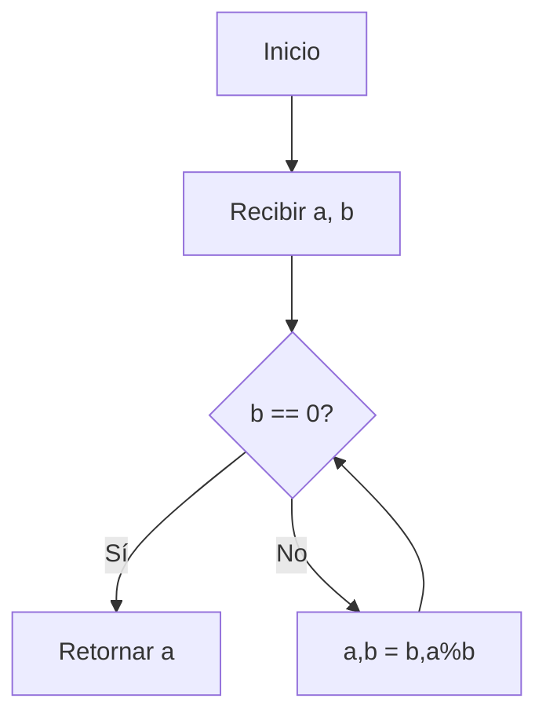
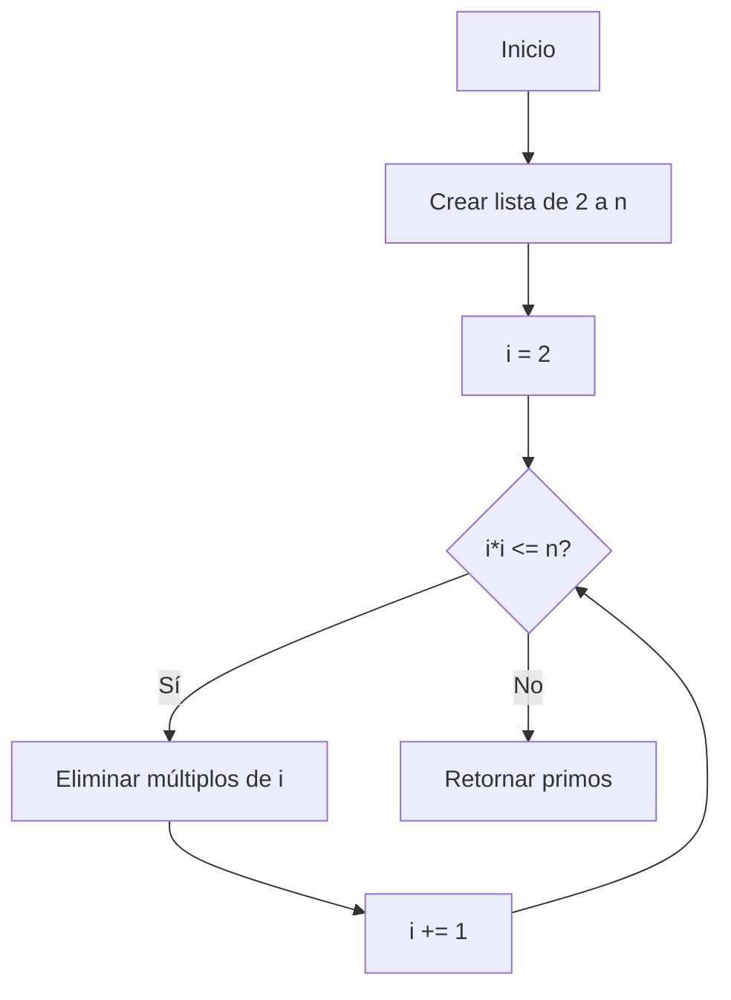

# 🧩 Módulo 4: Estructuras de Datos y Algoritmos Básicos
## **Tema 4.6: Algoritmos Clásicos y Modernos**

---

### 🧠 Introducción General

Los algoritmos son el núcleo de toda ciencia de la computación. Desde los tiempos de Euclides hasta la inteligencia artificial moderna, representan el conjunto de pasos definidos que permiten resolver un problema o transformar datos en información útil.
A lo largo de la historia, los algoritmos han evolucionado desde simples métodos matemáticos hasta sistemas complejos que gobiernan la comunicación, la optimización industrial y el aprendizaje automático.

En este apunte exploraremos los **principales algoritmos clásicos y modernos**, comprendiendo su objetivo, fundamento teórico, origen y ejemplo en Python.

---

## 🧮 1. Algoritmos Fundamentales / Clásicos

### **1.1. Algoritmo de Euclides (Máximo Común Divisor - GCD)**

**Objetivo / Aplicación:** Calcular el máximo común divisor de dos números enteros.

**Fundamento teórico:**
Basado en el principio de que el MCD entre dos números `a` y `b` (con `a > b`) es igual al MCD de `b` y el residuo de `a ÷ b`.
**Complejidad:** Temporal O(log min(a,b)) | Espacial O(1)
**Clasificación:** Matemático / Determinístico / Iterativo
**Origen:** Euclides (~300 a.C.)



```python
def mcd(a, b):
    while b != 0:
        a, b = b, a % b
    return a

print(mcd(48, 18))  # Resultado: 6
```

---

### **1.2. Criba de Eratóstenes**

**Objetivo:** Generar todos los números primos hasta un valor `n`.
**Fundamento:** Marca múltiplos de cada número primo como no primos.
**Complejidad:** Temporal O(n log log n) | Espacial O(n)
**Clasificación:** Matemático / Iterativo / Determinístico
**Origen:** Eratóstenes de Cirene (~200 a.C.)



```python
def criba(n):
    primos = [True] * (n+1)
    primos[0:2] = [False, False]
    for i in range(2, int(n**0.5) + 1):
        if primos[i]:
            for j in range(i*i, n+1, i):
                primos[j] = False
    return [x for x in range(2, n+1) if primos[x]]

print(criba(30))
```

---

### **1.3. Exponentiación rápida (Exponentiation by Squaring)**

**Objetivo:** Calcular `a^b` de forma eficiente.
**Fundamento:** Divide el exponente por 2 y usa propiedades de potencia.
**Complejidad:** Temporal O(log n) | Espacial O(1)
**Clasificación:** Matemático / Recursivo / Divide y vencerás
**Origen:** Gauss (S. XIX)

```python
def potencia(a, n):
    if n == 0:
        return 1
    elif n % 2 == 0:
        mitad = potencia(a, n//2)
        return mitad * mitad
    else:
        return a * potencia(a, n-1)

print(potencia(3, 7))  # 2187
```

---

### **1.4. Transformada Rápida de Fourier (FFT)**

**Objetivo:** Calcular la transformada discreta de Fourier de manera eficiente.
**Fundamento:** Divide la señal en pares/impares y aplica recursión (divide y vencerás).
**Complejidad:** O(n log n) | Espacial O(n)
**Clasificación:** Numérico / Recursivo / Divide y vencerás
**Origen:** Cooley y Tukey (1965)

```python
import cmath

def fft(x):
    N = len(x)
    if N <= 1:
        return x
    pares = fft(x[0::2])
    impares = fft(x[1::2])
    factor = [cmath.exp(-2j * cmath.pi * k / N) * impares[k] for k in range(N//2)]
    return [pares[k] + factor[k] for k in range(N//2)] +            [pares[k] - factor[k] for k in range(N//2)]

print(fft([0,1,2,3]))
```

---

### **1.5. Newton-Raphson**

**Objetivo:** Aproximar raíces de funciones f(x)=0.
**Fundamento:** Usa derivadas para aproximar mediante tangentes sucesivas.
**Complejidad:** O(k) donde k es número de iteraciones | Espacial O(1)
**Clasificación:** Numérico / Iterativo / Aproximado
**Origen:** Isaac Newton (1669), Joseph Raphson (1690)

```python
def newton(f, df, x0, tol=1e-6, max_iter=50):
    x = x0
    for _ in range(max_iter):
        x1 = x - f(x)/df(x)
        if abs(x1 - x) < tol:
            return x1
        x = x1
    return x

print(newton(lambda x: x**2 - 2, lambda x: 2*x, 1))
```

## 📚 Referencias
- Cormen, T. H. *Introduction to Algorithms* (MIT Press, 2009)
- Goodrich & Tamassia. *Data Structures and Algorithms in Python* (Wiley, 2015)
- Downey, A. *Think Python*
- Sutton & Barto. *Reinforcement Learning: An Introduction*
- Mitchell, T. *Machine Learning* (McGraw-Hill)
