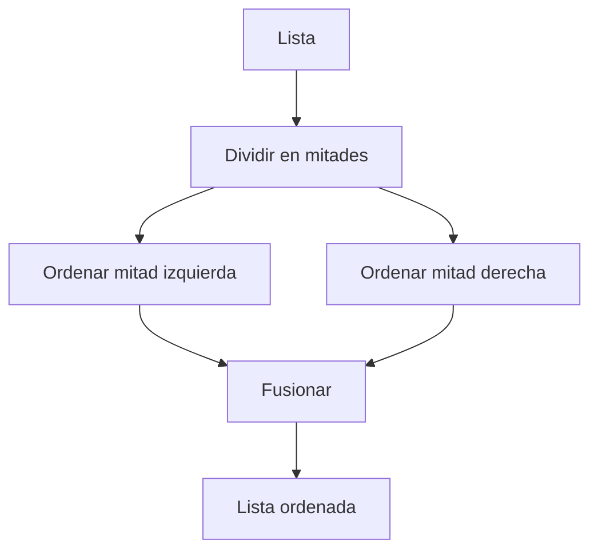
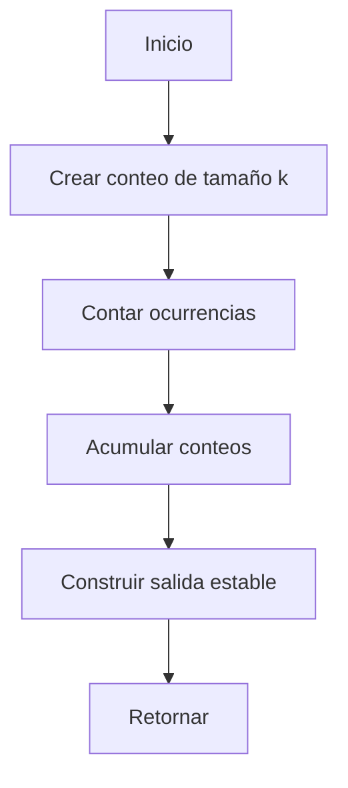

# 🧩 Módulo 4: Estructuras de Datos y Algoritmos Básicos
## **Sección 2: Búsqueda y Ordenamiento**

---

### 🧠 Introducción de la sección

En esta sección abordamos los **algoritmos fundamentales de búsqueda y ordenamiento**. Su correcta elección impacta directamente en la **eficiencia temporal y espacial** de los sistemas. Presentamos cada algoritmo con: **objetivo**, **fundamento teórico** (incluyendo complejidad y taxonomía), **origen**, **diagrama Mermaid** del flujo lógico y **ejemplo en Python** sin dependencias externas.

---

## 🔎 2.1. Búsqueda Binaria (Binary Search)

**Objetivo / Aplicación:** Encontrar la posición de un elemento en una **lista ordenada** con el menor número de comparaciones posible.

**Fundamento teórico:** Parte el espacio de búsqueda en mitades iterativamente comparando el valor objetivo con el elemento medio.
**Complejidad temporal:** O(log n) (mejor: O(1)) · **Complejidad espacial:** O(1) (iterativa) / O(log n) (recursiva)
**Clasificación (taxonomía):** Búsqueda · Determinístico · Divide y vencerás · Requiere datos **ordenados**.
**Origen / Descubridor:** Documentado por **John Mauchly** (1946) y formalizado ampliamente en textos clásicos de algoritmos.

```mermaid
flowchart TD
  A[Inicio] --> B[ini=0, fin=n-1]
  B --> C{ini <= fin?}
  C -->|No| D[No encontrado]
  C -->|Sí| E[medio=(ini+fin)//2]
  E --> F{lista[medio] == x?}
  F -->|Sí| G[Retornar medio]
  F -->|No y lista[medio] < x| H[ini = medio + 1]
  F -->|No y lista[medio] > x| I[fin = medio - 1]
  H --> C
  I --> C
```

```python
def binary_search(arr, x):
    ini, fin = 0, len(arr) - 1
    while ini <= fin:
        medio = (ini + fin) // 2
        if arr[medio] == x:
            return medio
        if arr[medio] < x:
            ini = medio + 1
        else:
            fin = medio - 1
    return -1

# Ejemplo
datos = [1, 3, 4, 7, 9, 11, 15]
print(binary_search(datos, 7))   # 3
print(binary_search(datos, 10))  # -1
```

---

## 🔁 2.2. Bubble Sort

**Objetivo / Aplicación:** Ordenar una lista realizando **intercambios de pares adyacentes** fuera de orden; útil con fines **didácticos** y listas muy pequeñas.

**Fundamento teórico:** Repite pasadas burbujeando el máximo (o mínimo) hacia el extremo.
**Complejidad temporal:** O(n²) (mejor: O(n) si se detectan pases sin swaps) · **Complejidad espacial:** O(1)
**Clasificación:** Ordenamiento por comparaciones · In-place · Estable (en variante clásica) · Determinístico.
**Origen / Descubridor:** Popularizado en los años 60 en literatura educativa de programación.

```mermaid
flowchart TD
  A[Inicio] --> B[i=0..n-2]
  B --> C[j=0..n-i-2]
  C --> D{arr[j] > arr[j+1]?}
  D -->|Sí| E[swap arr[j],arr[j+1]]
  D -->|No| F[Sigue]
  E --> C
  F --> C
```

```python
def bubble_sort(arr):
    n = len(arr)
    for i in range(n - 1):
        swapped = False
        for j in range(n - i - 1):
            if arr[j] > arr[j + 1]:
                arr[j], arr[j + 1] = arr[j + 1], arr[j]
                swapped = True
        if not swapped:  # optimización
            break
    return arr

print(bubble_sort([5,3,8,1,2]))
```

---

## 🃏 2.3. Selection Sort

**Objetivo / Aplicación:** Ordenar seleccionando **el mínimo** (o máximo) y colocándolo en su posición final en cada iteración.

**Fundamento teórico:** Encuentra el mínimo en la sublista restante y lo intercambia con la posición actual.
**Complejidad temporal:** O(n²) · **Complejidad espacial:** O(1)
**Clasificación:** Ordenamiento por comparaciones · In-place · **No** estable (en implementación estándar) · Determinístico.
**Origen:** Descrito en textos clásicos de programación y análisis de algoritmos (mediados del s. XX).

```mermaid
flowchart TD
  A[Inicio] --> B[i=0..n-1]
  B --> C[min=i; j=i+1..n-1]
  C --> D{arr[j] < arr[min]?}
  D -->|Sí| E[min=j]
  D -->|No| F[continúa]
  E --> C
  F --> G[swap arr[i],arr[min]]
  G --> B
```

```python
def selection_sort(arr):
    n = len(arr)
    for i in range(n):
        min_idx = i
        for j in range(i + 1, n):
            if arr[j] < arr[min_idx]:
                min_idx = j
        arr[i], arr[min_idx] = arr[min_idx], arr[i]
    return arr

print(selection_sort([5,3,8,1,2]))
```

---

## 🃜 2.4. Insertion Sort

**Objetivo / Aplicación:** Ordenar insertando cada elemento en la **posición correcta** de la parte ya ordenada; muy eficiente para **listas pequeñas** o **casi ordenadas**.

**Fundamento teórico:** Recorre y desplaza elementos mayores para insertar el actual en el hueco correcto.
**Complejidad temporal:** O(n²) (mejor: O(n)) · **Complejidad espacial:** O(1)
**Clasificación:** Ordenamiento por comparaciones · In-place · Estable · Determinístico.
**Origen:** Enseñado tradicionalmente como analogía a **ordenar cartas**.

```mermaid
flowchart TD
  A[Inicio] --> B[i=1..n-1]
  B --> C[key=arr[i]; j=i-1]
  C --> D{j>=0 y arr[j]>key?}
  D -->|Sí| E[arr[j+1]=arr[j]; j--]
  D -->|No| F[arr[j+1]=key]
  E --> D
  F --> B
```

```python
def insertion_sort(arr):
    for i in range(1, len(arr)):
        key = arr[i]
        j = i - 1
        while j >= 0 and arr[j] > key:
            arr[j + 1] = arr[j]
            j -= 1
        arr[j + 1] = key
    return arr

print(insertion_sort([5,3,8,1,2]))
```

---

## 🔀 2.5. Merge Sort

**Objetivo / Aplicación:** Ordenar eficientemente mediante **divide y vencerás**, garantizando **estabilidad**.

**Fundamento teórico:** Divide la lista en mitades, ordena recursivamente y **fusiona** dos listas ordenadas.
**Complejidad temporal:** O(n log n) · **Complejidad espacial:** O(n)
**Clasificación:** Ordenamiento por comparaciones · No in-place (clásico) · Estable · Determinístico · Divide y vencerás.
**Origen:** John von Neumann (1945).



```python
def merge(left, right):
    i = j = 0
    out = []
    while i < len(left) and j < len(right):
        if left[i] <= right[j]:
            out.append(left[i]); i += 1
        else:
            out.append(right[j]); j += 1
    out.extend(left[i:]); out.extend(right[j:])
    return out

def merge_sort(arr):
    if len(arr) <= 1:
        return arr
    mid = len(arr)//2
    return merge(merge_sort(arr[:mid]), merge_sort(arr[mid:]))

print(merge_sort([5,3,8,1,2]))
```

---

## ⚡ 2.6. Quick Sort

**Objetivo / Aplicación:** Ordenar en promedio en **O(n log n)** con bajo overhead y buena localidad de caché.

**Fundamento teórico:** Selecciona un **pivote** y particiona en menores/iguales/mayores, aplicando recursión.
**Complejidad temporal:** Promedio O(n log n); peor caso O(n²) · **Complejidad espacial:** O(log n) (profundidad de pila promedio)
**Clasificación:** Ordenamiento por comparaciones · No estable (habitual) · In-place (en versión Lomuto/Hoare) · Divide y vencerás.
**Origen:** Tony Hoare (1959).

```mermaid
flowchart TD
  A[Inicio] --> B{n<=1?}
  B -->|Sí| C[Retorna]
  B -->|No| D[Elegir pivote]
  D --> E[Particionar < = >]
  E --> F[QuickSort(izq)]
  E --> G[QuickSort(der)]
  F --> H[Concatenar izq+pivotes+der]
  G --> H
```

```python
def quicksort(arr):
    if len(arr) <= 1:
        return arr
    p = arr[len(arr)//2]
    left  = [x for x in arr if x < p]
    mid   = [x for x in arr if x == p]
    right = [x for x in arr if x > p]
    return quicksort(left) + mid + quicksort(right)

print(quicksort([5,3,8,1,2,7,4]))
```

---

## ⛰️ 2.7. Heap Sort

**Objetivo / Aplicación:** Ordenar utilizando un **heap binario** (máximo o mínimo).

**Fundamento teórico:** Construye un heap, luego **extrae** repetidamente el elemento raíz y lo coloca al final.
**Complejidad temporal:** O(n log n) · **Complejidad espacial:** O(1) (in-place)
**Clasificación:** Ordenamiento por comparaciones · In-place · No estable · Estructuras de prioridad.
**Origen:** J. W. J. Williams (1964); optimizado por Floyd (1964).

```mermaid
flowchart TD
  A[Inicio] --> B[Construir heap]
  B --> C[i=n-1..1]
  C --> D[swap arr[0], arr[i]]
  D --> E[heapify(0, i)]
  E --> C
```

```python
def heapify(arr, n, i):
    largest = i
    l, r = 2*i + 1, 2*i + 2
    if l < n and arr[l] > arr[largest]:
        largest = l
    if r < n and arr[r] > arr[largest]:
        largest = r
    if largest != i:
        arr[i], arr[largest] = arr[largest], arr[i]
        heapify(arr, n, largest)

def heap_sort(arr):
    n = len(arr)
    # construir heap
    for i in range(n//2 - 1, -1, -1):
        heapify(arr, n, i)
    # extraer
    for i in range(n-1, 0, -1):
        arr[0], arr[i] = arr[i], arr[0]
        heapify(arr, i, 0)
    return arr

print(heap_sort([5,3,8,1,2,7,4]))
```

---

## 🧮 2.8. Counting Sort (Enteros no negativos, rango acotado)

**Objetivo / Aplicación:** Ordenar **sin comparaciones** cuando los valores son enteros en un **rango conocido y pequeño**.

**Fundamento teórico:** Cuenta ocurrencias de cada valor y reconstruye la secuencia ordenada por **acumulación de frecuencias**.
**Complejidad temporal:** O(n + k) · **Complejidad espacial:** O(k) (k = rango)
**Clasificación:** Ordenamiento incremental · No comparativo · Estable (si se implementa con acumulación) · Determinístico.
**Origen:** Aparece en literatura de mediados del s. XX; base de Radix Sort.



```python
def counting_sort(arr, k):
    count = [0]*(k+1)
    for x in arr:
        count[x] += 1
    # acumulado para estabilidad
    for i in range(1, k+1):
        count[i] += count[i-1]
    out = [0]*len(arr)
    for x in reversed(arr):
        count[x] -= 1
        out[count[x]] = x
    return out

print(counting_sort([4,2,2,8,3,3,1], k=8))
```

---

## 🔢 2.9. Radix Sort (Base 10, enteros no negativos)

**Objetivo / Aplicación:** Ordenar **no comparativamente** procesando dígito a dígito (LSB→MSB), apoyándose en un método estable (p. ej., Counting Sort).

**Fundamento teórico:** Ordena por cada posición de dígito usando un ordenamiento **estable**, garantizando que el orden por dígitos previos se conserve.
**Complejidad temporal:** O(d·(n + b)) donde d= #dígitos, b= base (10) · **Complejidad espacial:** O(n + b)
**Clasificación:** Ordenamiento no comparativo · Estable · Determinístico.
**Origen:** Desarrollos de la era de tarjetas perforadas; formalizado en literatura de procesamiento numérico.

```mermaid
flowchart TD
  A[Inicio] --> B[exp=1]
  B --> C{max/exp > 0?}
  C -->|No| D[Fin]
  C -->|Sí| E[Counting por dígito (estable)]
  E --> F[exp *= 10]
  F --> C
```

```python
def counting_by_digit(arr, exp, base=10):
    count = [0]*base
    out = [0]*len(arr)
    for x in arr:
        idx = (x // exp) % base
        count[idx] += 1
    for i in range(1, base):
        count[i] += count[i-1]
    for x in reversed(arr):
        idx = (x // exp) % base
        count[idx] -= 1
        out[count[idx]] = x
    return out

def radix_sort(arr):
    if not arr:
        return arr
    m = max(arr)
    exp = 1
    out = arr[:]
    while m // exp > 0:
        out = counting_by_digit(out, exp, 10)
        exp *= 10
    return out

print(radix_sort([170,45,75,90,802,24,2,66]))
```

---

### ✅ Cierre de la sección 2

- **Búsqueda:** Binary Search reduce el espacio en potencias de 2 → **O(log n)**, requisito: datos **ordenados**.
- **Ordenamiento:** elegir según **n**, **distribución**, **estabilidad** y **memoria**. Para casos generales: **Merge/Quick/Heap**; para enteros acotados: **Counting/Radix**; para conjuntos pequeños o casi ordenados: **Insertion**.

---
