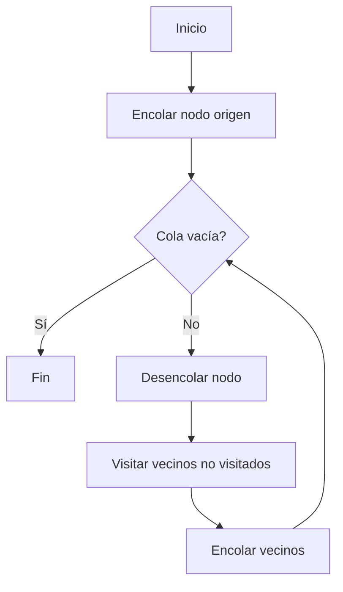
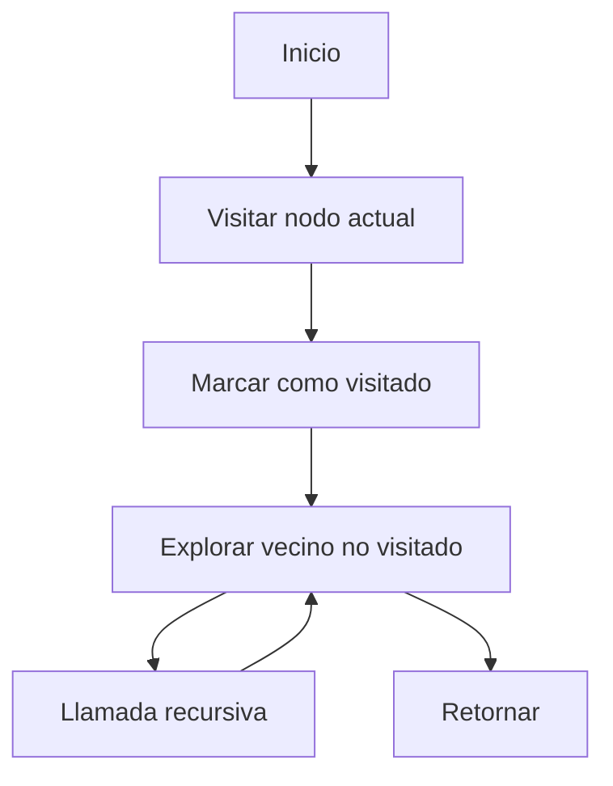

# 🧩 Módulo 4: Estructuras de Datos y Algoritmos Básicos
## **Sección 3: Algoritmos de Grafos**

---

### 🧠 Introducción General

Un **grafo** es una estructura matemática compuesta por **nodos (vértices)** y **enlaces (aristas)** que los conectan.
Se utilizan para modelar redes, caminos, relaciones y dependencias en una amplia variedad de contextos: desde redes de transporte y comunicación hasta estructuras de datos y optimización.

Los grafos pueden ser:
- **Dirigidos / No dirigidos**
- **Ponderados / No ponderados**
- **Cíclicos / Acíclicos**

En programación, la representación más común y clara es la **lista de adyacencia**, implementada usualmente como un **diccionario** en Python.

---

## 🔹 3.1. Búsqueda en Amplitud (Breadth-First Search – BFS)

**Objetivo / Aplicación:**
Recorrer un grafo nivel por nivel, encontrando el **camino más corto (en número de aristas)** desde un nodo origen en grafos no ponderados.

**Fundamento teórico:**
Utiliza una **cola (queue)** para expandir los vértices en orden creciente de distancia desde la raíz.
**Complejidad temporal:** O(V + E) · **Espacial:** O(V)
**Clasificación:** Recorrido / Determinístico / Iterativo / No ponderado
**Origen:** Formalizado por **E. F. Moore (1959)**.



```python
from collections import deque

def bfs(graph, start):
    visitado = set([start])
    cola = deque([start])
    while cola:
        nodo = cola.popleft()
        print(nodo, end=" ")
        for vecino in graph[nodo]:
            if vecino not in visitado:
                visitado.add(vecino)
                cola.append(vecino)

grafo = {
    'A': ['B', 'C'],
    'B': ['D', 'E'],
    'C': ['F'],
    'D': [], 'E': ['F'], 'F': []
}
bfs(grafo, 'A')
```

---

## 🔹 3.2. Búsqueda en Profundidad (Depth-First Search – DFS)

**Objetivo / Aplicación:**
Recorrer el grafo explorando cada camino hasta su fin antes de retroceder; útil para **detección de ciclos**, **topological sort**, y **componentes conexas**.

**Fundamento teórico:**
Usa una **pila (stack)** o recursión para explorar recursivamente los nodos.
**Complejidad temporal:** O(V + E) · **Espacial:** O(V) (por recursión)
**Clasificación:** Recorrido / Determinístico / Recursivo
**Origen:** Descrito formalmente por **Trémaux (1859)** y usado en teoría de grafos moderna.



```python
def dfs(graph, nodo, visitado=None):
    if visitado is None:
        visitado = set()
    visitado.add(nodo)
    print(nodo, end=" ")
    for vecino in graph[nodo]:
        if vecino not in visitado:
            dfs(graph, vecino, visitado)

grafo = {
    'A': ['B', 'C'],
    'B': ['D', 'E'],
    'C': ['F'],
    'D': [], 'E': ['F'], 'F': []
}
dfs(grafo, 'A')
```

---

## 🔹 3.3. Algoritmo de Dijkstra

**Objetivo / Aplicación:**
Encontrar la **ruta más corta** desde un nodo origen hacia todos los demás en un grafo **ponderado con pesos no negativos**.

**Fundamento teórico:**
Mantiene una **cola de prioridad** para expandir el nodo con menor distancia acumulada.
**Complejidad temporal:** O((V + E) log V) usando heap · **Espacial:** O(V)
**Clasificación:** Caminos mínimos / Greedy / Determinístico
**Origen:** **Edsger Dijkstra (1956)**

```mermaid
flowchart TD
A[Inicio] --> B[Inicializar distancias = ∞]
B --> C[dist[start]=0]
C --> D[Usar cola de prioridad]
D --> E[Extraer nodo con menor distancia]
E --> F[Actualizar distancias de vecinos]
F --> G{Cola vacía?}
G -->|No| E
G -->|Sí| H[Fin]
```

```python
import heapq

def dijkstra(graph, start):
    dist = {v: float('inf') for v in graph}
    dist[start] = 0
    pq = [(0, start)]
    while pq:
        d, u = heapq.heappop(pq)
        if d > dist[u]:
            continue
        for v, w in graph[u]:
            if dist[u] + w < dist[v]:
                dist[v] = dist[u] + w
                heapq.heappush(pq, (dist[v], v))
    return dist

grafo = {
    'A': [('B', 2), ('C', 5)],
    'B': [('C', 1), ('D', 3)],
    'C': [('D', 2)],
    'D': []
}
print(dijkstra(grafo, 'A'))
```

---

## 🔹 3.4. Bellman-Ford

**Objetivo / Aplicación:**
Encontrar caminos más cortos incluso con **pesos negativos**, detectando si existen **ciclos negativos**.

**Fundamento teórico:**
Relaja todas las aristas V−1 veces y verifica ciclos en una iteración adicional.
**Complejidad temporal:** O(V·E) · **Espacial:** O(V)
**Clasificación:** Caminos mínimos / Determinístico / Dinámico
**Origen:** **Richard Bellman (1958)** y **Lester Ford (1956)**

```python
def bellman_ford(edges, V, start):
    dist = {v: float('inf') for v in range(V)}
    dist[start] = 0
    for _ in range(V-1):
        for u, v, w in edges:
            if dist[u] + w < dist[v]:
                dist[v] = dist[u] + w
    # detección de ciclo negativo
    for u, v, w in edges:
        if dist[u] + w < dist[v]:
            raise ValueError("Ciclo negativo detectado")
    return dist

edges = [(0,1,5),(0,2,4),(1,3,3),(2,1,6),(3,2,-2)]
print(bellman_ford(edges, 4, 0))
```

---

## 🔹 3.5. Floyd-Warshall

**Objetivo / Aplicación:**
Encontrar los **caminos más cortos entre todos los pares de vértices**.
**Fundamento teórico:**
Relaja todas las combinaciones posibles mediante programación dinámica.
**Complejidad temporal:** O(V³) · **Espacial:** O(V²)
**Clasificación:** Caminos mínimos / Dinámico / Determinístico
**Origen:** **Robert Floyd (1962)** y **Stephen Warshall (1962)**

```python
def floyd_warshall(dist):
    n = len(dist)
    for k in range(n):
        for i in range(n):
            for j in range(n):
                if dist[i][k] + dist[k][j] < dist[i][j]:
                    dist[i][j] = dist[i][k] + dist[k][j]
    return dist

mat = [
    [0, 5, float('inf'), 10],
    [float('inf'), 0, 3, float('inf')],
    [float('inf'), float('inf'), 0, 1],
    [float('inf'), float('inf'), float('inf'), 0]
]
for fila in floyd_warshall(mat):
    print(fila)
```

---

## 🔹 3.6. Prim (Árbol de Expansión Mínima)

**Objetivo / Aplicación:**
Encontrar el **árbol de expansión mínima (MST)** conectando todos los vértices con el **menor peso total**.

**Fundamento teórico:**
Expande un árbol conectando el vértice más cercano aún no incluido.
**Complejidad temporal:** O(E log V) con heap · **Espacial:** O(V)
**Clasificación:** Greedy / Determinístico / Árbol mínimo
**Origen:** **Robert Prim (1957)**

```python
import heapq

def prim(graph, start):
    visit = set([start])
    edges = [(w, start, v) for v, w in graph[start]]
    heapq.heapify(edges)
    mst = []
    while edges:
        w, u, v = heapq.heappop(edges)
        if v not in visit:
            visit.add(v)
            mst.append((u, v, w))
            for nxt, w2 in graph[v]:
                if nxt not in visit:
                    heapq.heappush(edges, (w2, v, nxt))
    return mst

grafo = {
    'A': [('B', 1), ('C', 3)],
    'B': [('A', 1), ('C', 1), ('D', 4)],
    'C': [('A', 3), ('B', 1), ('D', 1)],
    'D': [('B', 4), ('C', 1)]
}
print(prim(grafo, 'A'))
```

---

## 🔹 3.7. Kruskal

**Objetivo / Aplicación:**
Construir el MST seleccionando aristas en orden creciente de peso sin formar ciclos.
**Fundamento teórico:**
Usa estructura **Union-Find** para detectar ciclos.
**Complejidad temporal:** O(E log E) · **Espacial:** O(V)
**Clasificación:** Greedy / Determinístico / Árbol mínimo
**Origen:** **Joseph Kruskal (1956)**

```python
def kruskal(edges, V):
    parent = list(range(V))
    def find(x):
        while parent[x] != x:
            x = parent[x]
        return x
    def union(x, y):
        px, py = find(x), find(y)
        if px != py:
            parent[py] = px

    edges.sort(key=lambda x: x[2])
    mst = []
    for u, v, w in edges:
        if find(u) != find(v):
            union(u, v)
            mst.append((u, v, w))
    return mst

edges = [(0,1,1),(1,2,1),(0,2,3),(1,3,4),(2,3,1)]
print(kruskal(edges, 4))
```

---

## 🔹 3.8. A* (A-Star)

**Objetivo / Aplicación:**
Buscar el **camino más corto** utilizando una **heurística informada** (estimación al destino).
**Fundamento teórico:**
Combina costo real (g) y heurístico (h): `f(n) = g(n) + h(n)`
**Complejidad:** Depende de la heurística · **Clasificación:** Heurístico / IA / Informado
**Origen:** **Hart, Nilsson y Raphael (1968)**

```python
import heapq

def astar(graph, start, goal, h):
    pq = [(0 + h[start], 0, start, [])]
    visited = set()
    while pq:
        f, g, node, path = heapq.heappop(pq)
        if node == goal:
            return path + [node]
        if node in visited:
            continue
        visited.add(node)
        for neigh, w in graph[node]:
            heapq.heappush(pq, (g+w+h[neigh], g+w, neigh, path+[node]))
    return None

grafo = {'A':[('B',1),('C',3)],'B':[('D',1)],'C':[('D',1)],'D':[]}
heur = {'A':2,'B':1,'C':1,'D':0}
print(astar(grafo,'A','D',heur))
```

---

## 🔹 3.9. Topological Sort

**Objetivo / Aplicación:**
Ordenar nodos de un **grafo dirigido acíclico (DAG)** en secuencia tal que toda arista (u→v) respete el orden.
**Complejidad temporal:** O(V + E) · **Espacial:** O(V)
**Clasificación:** Ordenamiento / Determinístico / DAG
**Origen:** Concepto formalizado en teoría de grafos moderna.

```python
def topological_sort(graph):
    visited, stack = set(), []
    def dfs(v):
        visited.add(v)
        for n in graph[v]:
            if n not in visited:
                dfs(n)
        stack.append(v)
    for v in graph:
        if v not in visited:
            dfs(v)
    return stack[::-1]

grafo = {'A':['B','C'],'B':['D'],'C':['D'],'D':[]}
print(topological_sort(grafo))
```

---

## 🔹 3.10. Tarjan – Componentes Fuertemente Conexas

**Objetivo / Aplicación:**
Identificar **subgrafos fuertemente conexos (SCCs)** en un grafo dirigido.
**Fundamento teórico:**
Usa DFS con índices y pila para agrupar vértices interconectados.
**Complejidad:** O(V + E) · **Clasificación:** Análisis estructural / DFS / Determinístico
**Origen:** **Robert Tarjan (1972)**

```python
def tarjanscc(graph):
    index, stack, lowlink, onstack = {}, [], {}, set()
    result = []
    i = 0

    def dfs(v):
        nonlocal i
        index[v] = lowlink[v] = i; i += 1
        stack.append(v); onstack.add(v)
        for w in graph[v]:
            if w not in index:
                dfs(w); lowlink[v] = min(lowlink[v], lowlink[w])
            elif w in onstack:
                lowlink[v] = min(lowlink[v], index[w])
        if lowlink[v] == index[v]:
            comp = []
            while True:
                w = stack.pop(); onstack.remove(w); comp.append(w)
                if w == v: break
            result.append(comp)

    for v in graph:
        if v not in index:
            dfs(v)
    return result

grafo = {'A':['B'],'B':['C'],'C':['A','D'],'D':['E'],'E':['D']}
print(tarjanscc(grafo))
```

---

### ✅ Cierre de la Sección 3

Los **algoritmos de grafos** son esenciales para la representación de redes y la resolución de problemas de optimización, navegación, planificación y análisis estructural.
- **BFS/DFS**: recorridos fundamentales.
- **Dijkstra / Bellman-Ford / Floyd-Warshall**: caminos más cortos.
- **Prim / Kruskal**: árboles mínimos.
- **A***: búsqueda informada con heurísticas.
- **Topological / Tarjan**: estructura y orden de grafos dirigidos.

---
