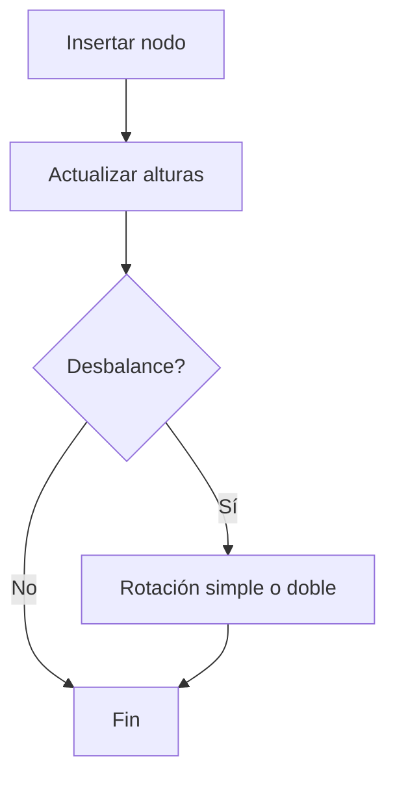
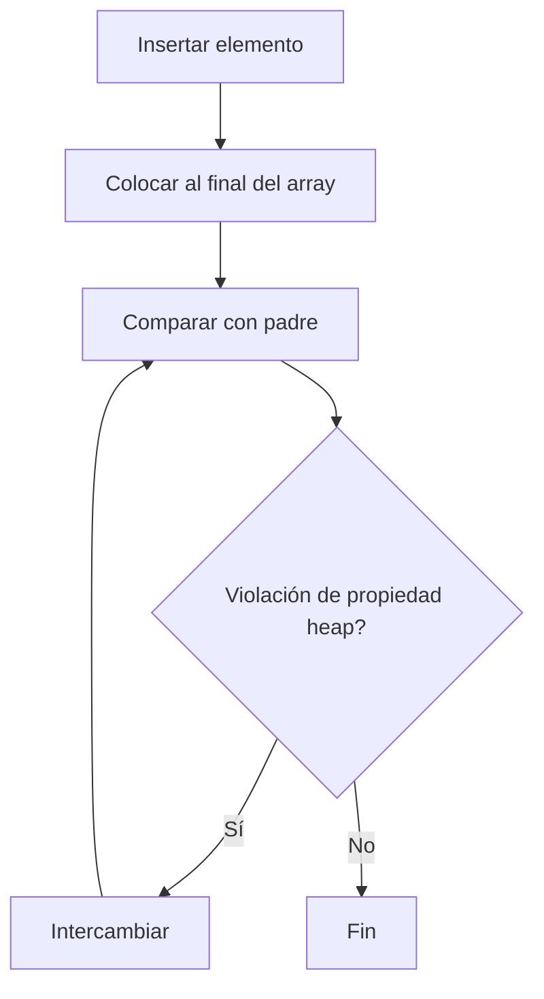
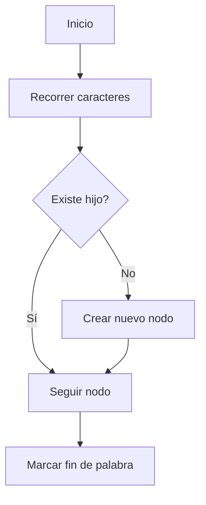
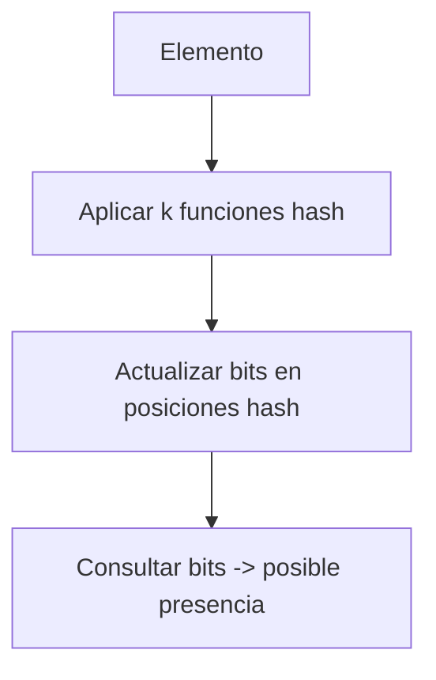

# 🧩 Módulo 4: Estructuras de Datos y Algoritmos Básicos
## **Sección 4: Estructuras de Datos y Gestión de Memoria**

---

### 🧠 Introducción General

Las **estructuras de datos** permiten almacenar, organizar y acceder eficientemente a la información.
Cada tipo de estructura está diseñada para resolver un tipo de problema específico, optimizando el uso de **tiempo y memoria**.
En esta sección veremos estructuras clásicas y avanzadas, con sus fundamentos y ejemplos en Python.

---

## 🔹 4.1. Hashing y Tablas Hash

**Objetivo / Aplicación:**
Permitir **búsqueda, inserción y eliminación en tiempo promedio O(1)**, utilizando una función hash que mapea claves a posiciones en un array.

**Fundamento teórico:**
Un valor clave se transforma en un índice mediante una **función hash**. Las colisiones (claves distintas con mismo hash) se resuelven con **encadenamiento** o **direccionamiento abierto**.
**Complejidad temporal:** Promedio O(1), peor caso O(n) · **Espacial:** O(n)
**Clasificación:** Estructura asociativa · Aleatoria · Determinística
**Origen:** Formalizada por **Hans Peter Luhn (1953)**, IBM.

```mermaid
flowchart TD
A[Clave] --> B[Función Hash]
B --> C[Índice del array]
C --> D{Colisión?}
D -->|No| E[Insertar elemento]
D -->|Sí| F[Resolver colisión (lista o nueva posición)]
```

```python
class HashTable:
    def __init__(self, size=10):
        self.size = size
        self.table = [[] for _ in range(size)]

    def _hash(self, key):
        return hash(key) % self.size

    def insert(self, key, value):
        idx = self._hash(key)
        for pair in self.table[idx]:
            if pair[0] == key:
                pair = (key, value)
                return
        self.table[idx].append((key, value))

    def get(self, key):
        idx = self._hash(key)
        for k, v in self.table[idx]:
            if k == key:
                return v
        return None

h = HashTable()
h.insert("nombre", "Flavio")
print(h.get("nombre"))
```

---

## 🌲 4.2. Árboles Balanceados (AVL / Red-Black)

**Objetivo / Aplicación:**
Mantener los datos **ordenados** con **búsqueda, inserción y eliminación en O(log n)**.
Evita el desbalanceo mediante rotaciones automáticas.

**Fundamento teórico:**
En un **árbol AVL**, la diferencia de alturas entre subárboles izquierdo y derecho es ≤ 1.
**Complejidad temporal:** O(log n) para operaciones básicas · **Espacial:** O(n)
**Clasificación:** Árbol binario de búsqueda balanceado · Determinístico
**Origen:** **Adelson-Velsky y Landis (1962)**.



```python
class Node:
    def __init__(self, key):
        self.key = key
        self.left = None
        self.right = None
        self.height = 1

def height(n): return n.height if n else 0

def rotate_right(y):
    x = y.left
    T2 = x.right
    x.right = y
    y.left = T2
    y.height = max(height(y.left), height(y.right)) + 1
    x.height = max(height(x.left), height(x.right)) + 1
    return x

def rotate_left(x):
    y = x.right
    T2 = y.left
    y.left = x
    x.right = T2
    x.height = max(height(x.left), height(x.right)) + 1
    y.height = max(height(y.left), height(y.right)) + 1
    return y

def balance_factor(n): return height(n.left) - height(n.right) if n else 0

def insert(root, key):
    if not root:
        return Node(key)
    if key < root.key:
        root.left = insert(root.left, key)
    else:
        root.right = insert(root.right, key)

    root.height = 1 + max(height(root.left), height(root.right))
    balance = balance_factor(root)
    if balance > 1 and key < root.left.key:
        return rotate_right(root)
    if balance < -1 and key > root.right.key:
        return rotate_left(root)
    if balance > 1 and key > root.left.key:
        root.left = rotate_left(root.left)
        return rotate_right(root)
    if balance < -1 and key < root.right.key:
        root.right = rotate_right(root.right)
        return rotate_left(root)
    return root

r = None
for k in [10,20,30,40,50,25]:
    r = insert(r,k)
print("Raíz del árbol AVL:", r.key)
```

---

## ⛰️ 4.3. Heap (Montículo Binario)

**Objetivo / Aplicación:**
Estructura especializada para **extraer el elemento mínimo o máximo en O(log n)**.
Usada en colas de prioridad y algoritmos como **Dijkstra** o **HeapSort**.

**Fundamento teórico:**
Un **heap binario** cumple la propiedad: cada nodo es ≤ (min-heap) o ≥ (max-heap) que sus hijos.
**Complejidad temporal:** Inserción y extracción O(log n) · **Espacial:** O(n)
**Clasificación:** Árbol binario completo · Determinístico
**Origen:** **J. W. J. Williams (1964)**.



```python
import heapq

data = [5, 3, 8, 1, 2]
heapq.heapify(data)
heapq.heappush(data, 0)
print("Heap:", data)
print("Extraer menor:", heapq.heappop(data))
```

---

## 🔤 4.4. Trie (Árbol de Prefijos)

**Objetivo / Aplicación:**
Permitir búsqueda y almacenamiento eficiente de **cadenas o prefijos** (como autocompletado o diccionarios).

**Fundamento teórico:**
Cada nodo representa un carácter, y las rutas definen palabras completas.
**Complejidad temporal:** O(L) por palabra (L = longitud) · **Espacial:** O(N·Σ)
**Clasificación:** Árbol n-ario · Determinístico
**Origen:** **René de la Briandais (1959)**; nombre “Trie” de **Edward Fredkin (1960)**.



```python
class TrieNode:
    def __init__(self):
        self.children = {}
        self.is_end = False

class Trie:
    def __init__(self):
        self.root = TrieNode()

    def insert(self, word):
        node = self.root
        for ch in word:
            if ch not in node.children:
                node.children[ch] = TrieNode()
            node = node.children[ch]
        node.is_end = True

    def search(self, word):
        node = self.root
        for ch in word:
            if ch not in node.children:
                return False
            node = node.children[ch]
        return node.is_end

trie = Trie()
trie.insert("flavio")
trie.insert("flor")
print(trie.search("flor"))  # True
print(trie.search("flores"))  # False
```

---

## 🧮 4.5. Bloom Filter

**Objetivo / Aplicación:**
Estructura **probabilística** para verificar si un elemento *puede* estar presente en un conjunto, con **falsos positivos posibles pero falsos negativos imposibles**.

**Fundamento teórico:**
Usa múltiples **funciones hash** para marcar posiciones en un bit array.
**Complejidad temporal:** O(k) por operación · **Espacial:** O(m)
**Clasificación:** Probabilístico / No determinístico / Estructura compacta
**Origen:** **Burton Howard Bloom (1970)**.



```python
import hashlib

class BloomFilter:
    def __init__(self, size=100):
        self.size = size
        self.bit_array = [0]*size

    def _hashes(self, item):
        return [int(hashlib.md5(item.encode()).hexdigest(), 16) % self.size,
                int(hashlib.sha1(item.encode()).hexdigest(), 16) % self.size]

    def add(self, item):
        for h in self._hashes(item):
            self.bit_array[h] = 1

    def check(self, item):
        return all(self.bit_array[h] for h in self._hashes(item))

bf = BloomFilter()
bf.add("python")
print(bf.check("python"))  # True
print(bf.check("java"))    # False (o True con baja probabilidad)
```

---

### ✅ Cierre de la Sección 4

Estas estructuras son la base de la manipulación eficiente de datos:
- **HashTable:** Acceso directo mediante claves.
- **Árbol AVL:** Balance dinámico de datos ordenados.
- **Heap:** Base de colas de prioridad.
- **Trie:** Almacenamiento de cadenas jerárquicas.
- **Bloom Filter:** Compresión probabilística sin almacenamiento exacto.

---
