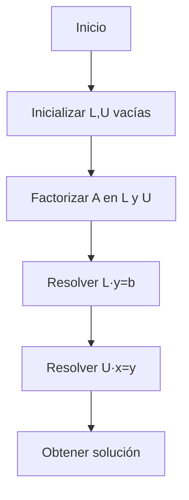
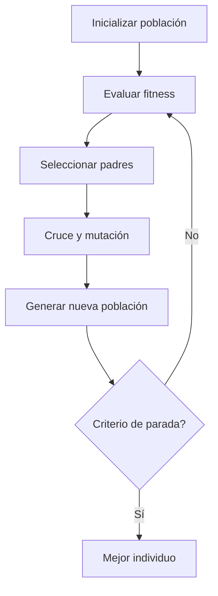
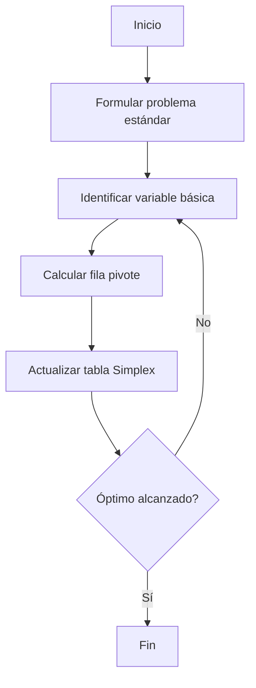

# 🧩 Módulo 4: Estructuras de Datos y Algoritmos Básicos
## **Sección 5: Algoritmos Numéricos y de Optimización**

---

### 🧠 Introducción General

Los **algoritmos numéricos y de optimización** son herramientas clave para resolver problemas continuos y discretos donde se busca un valor óptimo o una solución aproximada a sistemas de ecuaciones.
Se aplican en ingeniería, física, economía, aprendizaje automático y análisis de datos.

---

## 🔹 5.1. Método de Gauss-Jordan

**Objetivo / Aplicación:**
Resolver sistemas lineales de ecuaciones mediante eliminación directa, transformando la matriz aumentada en forma reducida.

**Fundamento teórico:**
Usa operaciones elementales sobre filas hasta convertir la matriz en la **matriz identidad**, obteniendo las soluciones directamente.
**Complejidad temporal:** O(n³) · **Espacial:** O(n²)
**Clasificación:** Algebra lineal / Determinístico / Directo
**Origen:** Generalizado por **Wilhelm Jordan (1887)**, basado en el método de **Carl Friedrich Gauss**.

```mermaid
flowchart TD
A[Inicio] --> B[Formar matriz aumentada A|b]
B --> C[Para cada fila pivotear]
C --> D[Normalizar pivote a 1]
D --> E[Eliminar valores en la misma columna]
E --> F[Continuar hasta identidad]
F --> G[Leer soluciones]
```

```python
def gauss_jordan(a, b):
    n = len(a)
    for i in range(n):
        # normalizar pivote
        factor = a[i][i]
        a[i] = [x / factor for x in a[i]]
        b[i] /= factor
        # eliminar resto de la columna
        for j in range(n):
            if j != i:
                factor = a[j][i]
                a[j] = [a[j][k] - factor * a[i][k] for k in range(n)]
                b[j] -= factor * b[i]
    return b

A = [[2,1,-1],[-3,-1,2],[-2,1,2]]
b = [8,-11,-3]
print("Solución:", gauss_jordan(A,b))
```

---

## 🔹 5.2. Descomposición LU

**Objetivo / Aplicación:**
Descomponer una matriz A en el producto de una matriz **L (triangular inferior)** y **U (triangular superior)** para resolver sistemas lineales con múltiples términos independientes eficientemente.

**Fundamento teórico:**
Permite resolver A·x = b mediante dos sustituciones sucesivas:
1. L·y = b
2. U·x = y
**Complejidad temporal:** O(n³) · **Espacial:** O(n²)
**Clasificación:** Algebra lineal / Determinístico / Directo
**Origen:** Desarrollado por **Tadeusz Banachiewicz (1938)**.



```python
def lu_decomposition(A):
    n = len(A)
    L = [[0]*n for _ in range(n)]
    U = [[0]*n for _ in range(n)]
    for i in range(n):
        L[i][i] = 1
        for j in range(i, n):
            U[i][j] = A[i][j] - sum(L[i][k]*U[k][j] for k in range(i))
        for j in range(i+1, n):
            L[j][i] = (A[j][i] - sum(L[j][k]*U[k][i] for k in range(i))) / U[i][i]
    return L, U

A = [[4,3],[6,3]]
L,U = lu_decomposition(A)
print("L=",L)
print("U=",U)
```

---

## 🔹 5.3. Descenso del Gradiente (Gradient Descent)

**Objetivo / Aplicación:**
Minimizar una función ajustando iterativamente sus parámetros en dirección opuesta al gradiente.
Usado en **machine learning** y **optimización numérica**.

**Fundamento teórico:**
Actualiza `x := x - α * ∇f(x)` hasta converger a un mínimo local.
**Complejidad temporal:** O(k·n) (k = iteraciones) · **Espacial:** O(n)
**Clasificación:** Numérico / Iterativo / Aproximado
**Origen:** **Augustin-Louis Cauchy (1847)**.

```mermaid
flowchart TD
A[Inicio] --> B[Inicializar x, tasa de aprendizaje α]
B --> C[Calcular gradiente ∇f(x)]
C --> D[Actualizar x = x - α∇f(x)]
D --> E{Convergencia?}
E -->|No| C
E -->|Sí| F[Retornar mínimo]
```

```python
def gradient_descent(f, df, x0, alpha=0.1, tol=1e-6, max_iter=100):
    x = x0
    for _ in range(max_iter):
        grad = df(x)
        x_new = x - alpha * grad
        if abs(x_new - x) < tol:
            break
        x = x_new
    return x

f = lambda x: (x-3)**2
df = lambda x: 2*(x-3)
print("Mínimo aproximado:", gradient_descent(f, df, x0=0))
```

---

## 🔹 5.4. Recocido Simulado (Simulated Annealing)

**Objetivo / Aplicación:**
Buscar soluciones aproximadas globales evitando mínimos locales mediante **aleatoriedad controlada**. Inspirado en procesos de **enfriamiento metálico**.

**Fundamento teórico:**
Acepta soluciones peores con probabilidad `p = exp(-ΔE/T)`, disminuyendo la temperatura `T` gradualmente.
**Complejidad temporal:** Dependiente del esquema de enfriamiento.
**Clasificación:** Probabilístico / Metaheurístico / Aproximado
**Origen:** **Kirkpatrick, Gelatt y Vecchi (1983)**.

```mermaid
flowchart TD
A[Inicio] --> B[Generar solución inicial]
B --> C[Evaluar costo E]
C --> D[Modificar solución -> E']
D --> E{E' < E o p<rand()?}
E -->|Sí| F[Aceptar nueva solución]
E -->|No| G[Rechazar]
F --> H[Reducir temperatura]
H --> C
```

```python
import math, random

def simulated_annealing(func, x0, T=1.0, cooling=0.95, min_T=1e-3):
    x = x0
    best = x
    while T > min_T:
        new_x = x + random.uniform(-1, 1)
        delta = func(new_x) - func(x)
        if delta < 0 or math.exp(-delta/T) > random.random():
            x = new_x
        if func(x) < func(best):
            best = x
        T *= cooling
    return best

f = lambda x: (x-2)**2 + 3
print("Mínimo aproximado:", simulated_annealing(f, 10))
```

---

## 🔹 5.5. Algoritmos Genéticos

**Objetivo / Aplicación:**
Resolver problemas de optimización mediante **simulación evolutiva**, usando operadores de **selección, cruce y mutación**.

**Fundamento teórico:**
Modela la evolución de una población de soluciones hacia mejores individuos.
**Complejidad temporal:** O(g·n·f) (g=generaciones, n=tamaño población, f=costo fitness)
**Clasificación:** Metaheurístico / Probabilístico / Evolutivo
**Origen:** **John Holland (1975)**.



```python
import random

def genetic_algorithm(fitness, n_gen=50, pop_size=10):
    pop = [random.uniform(-10,10) for _ in range(pop_size)]
    for _ in range(n_gen):
        pop = sorted(pop, key=fitness)
        next_gen = pop[:2]
        while len(next_gen) < pop_size:
            p1, p2 = random.sample(pop[:5], 2)
            child = (p1+p2)/2 + random.uniform(-1,1)
            next_gen.append(child)
        pop = next_gen
    return min(pop, key=fitness)

f = lambda x: (x-4)**2 + 2
print("Mejor valor:", genetic_algorithm(f))
```

---

## 🔹 5.6. Método Simplex (Programación Lineal)

**Objetivo / Aplicación:**
Resolver **problemas de optimización lineal**: maximizar o minimizar una función sujeta a restricciones lineales.

**Fundamento teórico:**
Explora vértices del politopo factible moviéndose en dirección de mejora del objetivo.
**Complejidad temporal:** Promedio polinómica, peor caso exponencial · **Espacial:** O(n²)
**Clasificación:** Determinístico / Optimización lineal / Iterativo
**Origen:** **George Dantzig (1947)**.



```python
# Ejemplo simplificado con 2 variables y 3 restricciones

def simplex_example():
    # Maximizar z = 3x + 2y sujeto a:
    # x + y <= 4, x <= 2, y <= 3
    best = (0,0)
    max_z = 0
    for x in range(3):
        for y in range(4):
            if x + y <= 4 and x <= 2 and y <= 3:
                z = 3*x + 2*y
                if z > max_z:
                    max_z = z
                    best = (x,y)
    return best, max_z

print("Óptimo:", simplex_example())
```

---

### ✅ Cierre de la Sección 5

Los algoritmos numéricos y de optimización permiten resolver desde ecuaciones lineales hasta modelos de decisión complejos.
- **Gauss-Jordan / LU:** resolución exacta.
- **Gradient Descent:** búsqueda de mínimos.
- **Simulated Annealing / Genéticos:** exploración global.
- **Simplex:** optimización lineal clásica.

---
