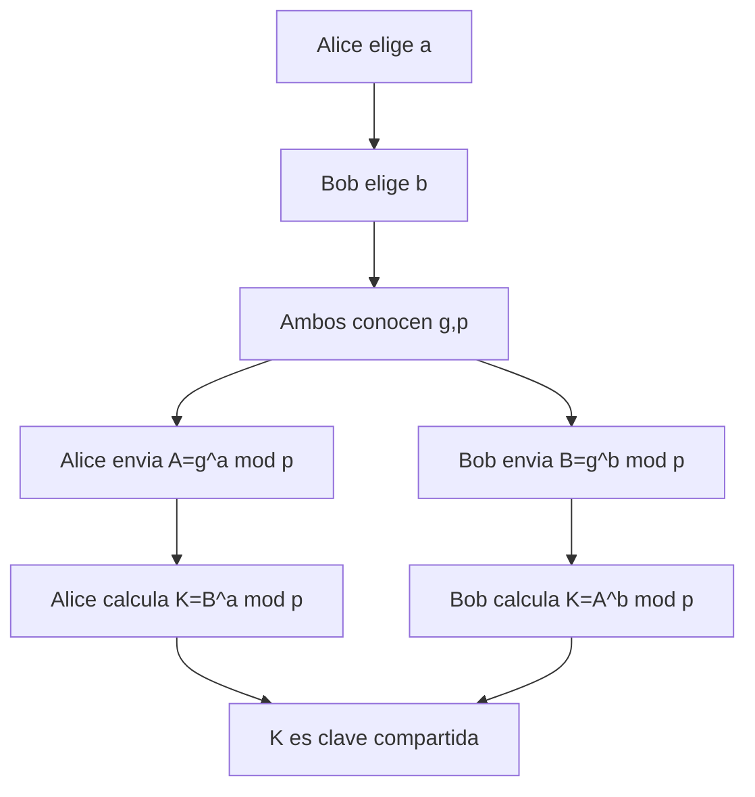
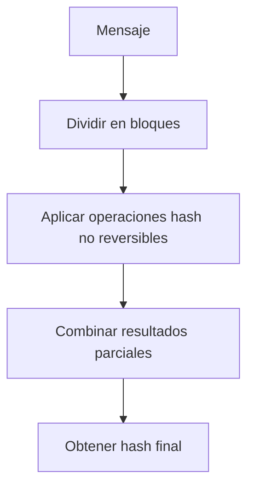
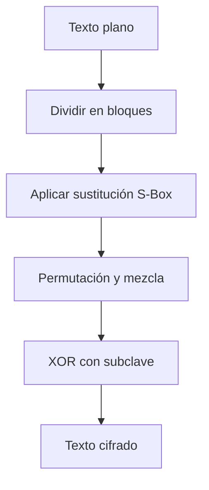
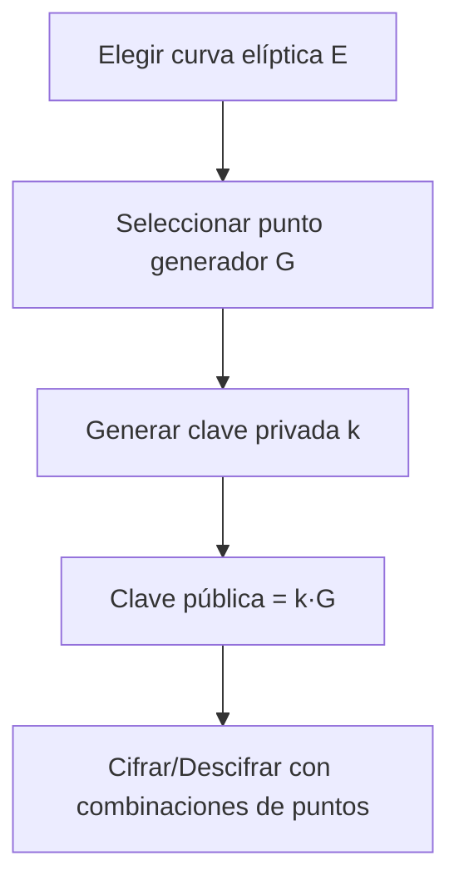

# 🧩 Módulo 4: Estructuras de Datos y Algoritmos Básicos
## **Sección 6: Criptografía y Seguridad**

---

### 🧠 Introducción General

La **criptografía** estudia los métodos para proteger la información mediante **transformaciones matemáticas** que impiden el acceso no autorizado.
Se basa en dos grandes paradigmas:

- **Cifrado simétrico:** misma clave para cifrar y descifrar.
- **Cifrado asimétrico:** clave pública y clave privada.

A esto se suman las **funciones hash** (resumen irrepetible de datos) y los sistemas de **firma digital y autenticación**.

---

## 🔹 6.1. RSA (Rivest–Shamir–Adleman)

**Objetivo / Aplicación:**
Proveer **cifrado asimétrico** y **firmas digitales** mediante operaciones de exponenciación modular con grandes primos.

**Fundamento teórico:**
Se basa en la dificultad de factorizar números grandes.
Genera dos claves: pública `(n, e)` y privada `(n, d)` tales que:
`c = m^e mod n` y `m = c^d mod n`.
**Complejidad:** Exponenciación modular O(log³ n) · **Clasificación:** Cifrado asimétrico / Determinístico
**Origen:** **Rivest, Shamir y Adleman (1977)**.

```mermaid
flowchart TD
A[Generar primos p,q] --> B[Calcular n=p*q y φ=(p-1)(q-1)]
B --> C[Elegir e coprimo con φ]
C --> D[Calcular d = e⁻¹ mod φ]
D --> E[Clave pública=(n,e), privada=(n,d)]
E --> F[Cifrar m→c = m^e mod n]
F --> G[Descifrar c→m = c^d mod n]
```

```python
def gcd(a,b):
    while b:
        a,b=b,a%b
    return a

def modinv(a,m):
    for x in range(1,m):
        if (a*x)%m==1:
            return x
    return None

def rsa_keygen():
    p,q=61,53
    n=p*q
    phi=(p-1)*(q-1)
    e=17
    d=modinv(e,phi)
    return (e,d,n)

e,d,n=rsa_keygen()
m=65
c=pow(m,e,n)
m2=pow(c,d,n)
print("Mensaje cifrado:",c,"Descifrado:",m2)
```

---

## 🔹 6.2. Intercambio de Claves Diffie-Hellman

**Objetivo / Aplicación:**
Permitir que dos partes acuerden una **clave secreta compartida** sin transmitirla explícitamente.

**Fundamento teórico:**
Basado en la dificultad del **problema del logaritmo discreto** en grupos finitos.
**Complejidad:** O(log n) para operaciones · **Clasificación:** Intercambio de claves / Asimétrico / Determinístico
**Origen:** **Whitfield Diffie y Martin Hellman (1976)**.



```python
p = 23  # número primo
g = 5   # generador
a = 6   # secreto de Alice
b = 15  # secreto de Bob

A = pow(g, a, p)
B = pow(g, b, p)
Ka = pow(B, a, p)
Kb = pow(A, b, p)
print("Clave compartida:", Ka, Kb)
```

---

## 🔹 6.3. Funciones Hash (SHA / MD5)

**Objetivo / Aplicación:**
Transformar datos arbitrarios en un **resumen fijo** (hash). Ideal para verificación de integridad, almacenamiento y autenticación.

**Fundamento teórico:**
Una buena función hash debe ser **unidireccional** (no reversible) y **resistente a colisiones**.
**Complejidad:** O(n) respecto al tamaño del mensaje · **Clasificación:** Hash criptográfico / Determinístico
**Origen:** **Ron Rivest (MD5, 1991)** y **NSA (SHA, 1993)**.



```python
import hashlib

texto = "seguridad"
print("MD5:", hashlib.md5(texto.encode()).hexdigest())
print("SHA1:", hashlib.sha1(texto.encode()).hexdigest())
print("SHA256:", hashlib.sha256(texto.encode()).hexdigest())
```

---

## 🔹 6.4. Cifrado Simétrico (AES / DES)

**Objetivo / Aplicación:**
Cifrar datos utilizando **la misma clave para cifrar y descifrar**.
AES reemplazó a DES como estándar internacional por su mayor seguridad y longitud de clave.

**Fundamento teórico:**
Divide el mensaje en **bloques**, aplica **sustitución, permutación y mezcla** controladas por la clave.
**Complejidad:** O(n) sobre longitud del texto · **Clasificación:** Cifrado por bloques / Determinístico
**Origen:** **DES (IBM, 1977)** · **AES (Daemen y Rijmen, 2001)**.



```python
# Ejemplo didáctico de XOR cifrado (concepto base del cifrado simétrico)
def xor_cipher(texto, clave):
    return ''.join(chr(ord(c)^clave) for c in texto)

msg = "hola"
clave = 23
cifrado = xor_cipher(msg, clave)
descifrado = xor_cipher(cifrado, clave)
print("Cifrado:", cifrado, "Descifrado:", descifrado)
```

---

## 🔹 6.5. Cifrado con Curvas Elípticas (ECC)

**Objetivo / Aplicación:**
Proporcionar seguridad equivalente a RSA con claves mucho más pequeñas.
Usa propiedades algebraicas de puntos sobre **curvas elípticas** en cuerpos finitos.

**Fundamento teórico:**
Basado en la dificultad del **problema del logaritmo discreto elíptico (ECDLP)**.
**Complejidad:** O(log³ n) · **Clasificación:** Asimétrico / Matemático / Determinístico
**Origen:** **Koblitz y Miller (1985)**.



```python
# Ejemplo conceptual (sin librerías externas)
# Operaciones se simplifican para ilustrar la idea de punto * escalar
class ECPoint:
    def __init__(self, x, y): self.x, self.y = x, y
    def __mul__(self, k): return ECPoint(self.x*k, self.y*k)  # simplificado
    def __repr__(self): return f"({self.x},{self.y})"

G = ECPoint(2,3)
priv = 7
pub = G * priv
print("Clave pública simulada:", pub)
```

---

### ✅ Cierre de la Sección 6

La criptografía moderna combina **matemática avanzada** con **tecnología práctica** para garantizar confidencialidad, autenticidad e integridad.
- **RSA / Diffie-Hellman / ECC:** cifrado asimétrico y claves públicas.
- **AES / DES:** cifrado simétrico eficiente.
- **SHA / MD5:** resumen y verificación de integridad.

---
