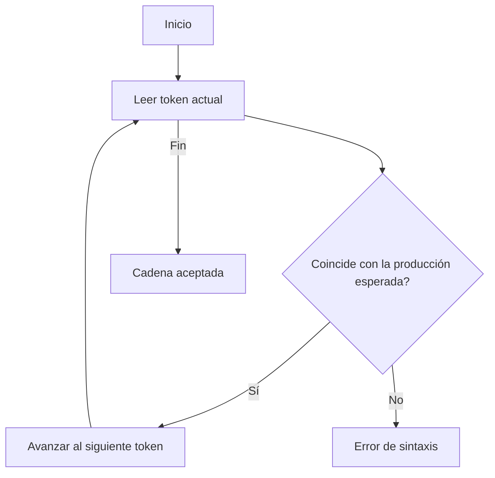
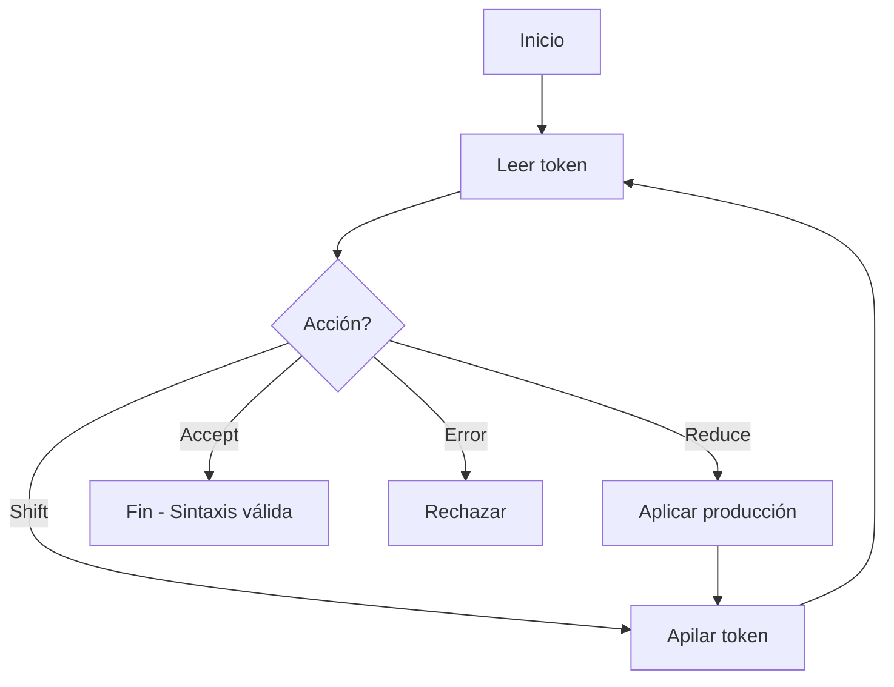
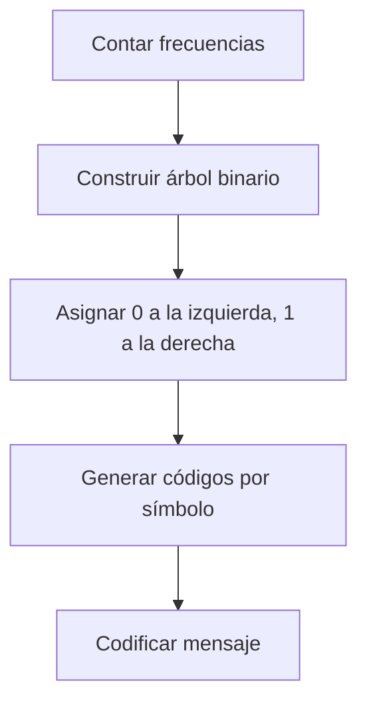

# 🧩 Módulo 4: Estructuras de Datos y Algoritmos Básicos
## **Sección 7: Compiladores y Procesamiento de Lenguajes**

---

### 🧠 Introducción General

Los **compiladores** son programas que traducen código fuente (de alto nivel) a un formato ejecutable (bajo nivel o máquina).
El proceso involucra **análisis léxico, sintáctico, semántico, optimización y generación de código**.

En esta sección veremos algoritmos esenciales para el procesamiento de lenguajes formales y compresión.

---

## 🔹 7.1. Algoritmo Shunting Yard (Dijkstra)

**Objetivo / Aplicación:**
Convertir expresiones **infijas** (ej. `3 + 4 * 2`) en **postfijas (RPN)**, facilitando la evaluación mediante una pila.

**Fundamento teórico:**
Usa dos pilas: una para **operandos** y otra para **operadores**, aplicando precedencia y asociatividad.
**Complejidad temporal:** O(n) · **Espacial:** O(n)
**Clasificación:** Análisis sintáctico / Determinístico / Basado en pila
**Origen:** **Edsger Dijkstra (1961)**.

```mermaid
flowchart TD
A[Inicio] --> B[Leer token]
B --> C{Operando?}
C -->|Sí| D[Agregar a salida]
C -->|No| E{Operador?}
E -->|Sí| F[Comparar precedencia]
F --> G[Desapilar operadores mayores o iguales]
G --> H[Apilar operador]
E -->|No (paréntesis)| I[Gestionar paréntesis]
I --> J[Siguiente token]
J --> B
B -->|Fin entrada| K[Vaciar pila a salida]
K --> L[Expresión postfija]
```

```python
def shunting_yard(expr):
    prec = {'+':1, '-':1, '*':2, '/':2}
    output, stack = [], []
    for token in expr.split():
        if token.isnumeric():
            output.append(token)
        elif token in prec:
            while stack and prec.get(stack[-1],0) >= prec[token]:
                output.append(stack.pop())
            stack.append(token)
        elif token == '(':
            stack.append(token)
        elif token == ')':
            while stack and stack[-1] != '(':
                output.append(stack.pop())
            stack.pop()
    while stack:
        output.append(stack.pop())
    return output

print("Postfija:", shunting_yard("3 + 4 * 2 / ( 1 - 5 )"))
```

---

## 🔹 7.2. Parsing LL(1)

**Objetivo / Aplicación:**
Analizar una secuencia de tokens **de izquierda a derecha** aplicando **descenso recursivo**.
Usado en compiladores simples y gramáticas sin ambigüedad.

**Fundamento teórico:**
Cada paso se guía por el **primer símbolo esperado** según una tabla predictiva.
**Complejidad:** O(n) · **Clasificación:** Determinístico / Predictivo
**Origen:** Teoría formal de compiladores (1960s).



```python
# Ejemplo LL(1) simple: Gramática E -> T + E | T ; T -> int
tokens = ["int", "+", "int"]
pos = 0

def E():
    global pos
    T()
    if pos < len(tokens) and tokens[pos] == "+":
        pos += 1
        E()

def T():
    global pos
    if pos < len(tokens) and tokens[pos] == "int":
        pos += 1
    else:
        raise ValueError("Error de sintaxis")

E()
print("Cadena aceptada" if pos == len(tokens) else "Error")
```

---

## 🔹 7.3. Parsing LR(0)

**Objetivo / Aplicación:**
Analizar **de izquierda a derecha** construyendo derivaciones **a la derecha más interna**.
Usado en compiladores reales (p. ej., yacc, bison).

**Fundamento teórico:**
Basado en una **pila de símbolos** y una tabla de acciones (shift/reduce).
**Complejidad:** O(n) · **Clasificación:** Determinístico / Basado en tabla
**Origen:** **Donald Knuth (1965)**.



```python
# Ejemplo conceptual simplificado de parser LR(0)
input_tokens = list("id+id*id$")
stack = ["$"]
print("Simulación LR(0):")
while True:
    top = stack[-1]
    tok = input_tokens[0]
    if tok == "$" and top == "$":
        print("✔ Cadena aceptada")
        break
    elif tok.isalnum():
        stack.append("id")
        input_tokens.pop(0)
    elif tok in "+*":
        stack.append(tok)
        input_tokens.pop(0)
    else:
        print("Reducir producción")
        stack.pop()
```

---

## 🔹 7.4. Algoritmo de Huffman (Compresión)

**Objetivo / Aplicación:**
Generar códigos binarios óptimos para cada símbolo según su frecuencia, logrando **compresión sin pérdida**.

**Fundamento teórico:**
Crea un **árbol binario de frecuencias** donde las hojas más frecuentes tienen códigos más cortos.
**Complejidad:** O(n log n) · **Clasificación:** Codificación óptima / Greedy
**Origen:** **David Huffman (1952)**.



```python
import heapq

def huffman_encode(data):
    freq = {}
    for c in data: freq[c] = freq.get(c,0)+1
    heap = [[f,[c,""]] for c,f in freq.items()]
    heapq.heapify(heap)
    while len(heap)>1:
        lo=heapq.heappop(heap); hi=heapq.heappop(heap)
        for pair in lo[1:]: pair[1]='0'+pair[1]
        for pair in hi[1:]: pair[1]='1'+pair[1]
        heapq.heappush(heap,[lo[0]+hi[0]]+lo[1:]+hi[1:])
    return sorted(heapq.heappop(heap)[1:], key=lambda p:(len(p[-1]),p))

msg = "hola mundo"
codes = huffman_encode(msg)
print("Códigos Huffman:", codes)
```

---

## 🧩 7.5. Diagrama General del Proceso de Compilación

```mermaid
flowchart TD
A[Programa Fuente] --> B[Análisis Léxico]
B --> C[Análisis Sintáctico (Parsing)]
C --> D[Análisis Semántico]
D --> E[Optimización de Código]
E --> F[Generación de Código Intermedio]
F --> G[Generación de Código Máquina]
G --> H[Programa Ejecutable]
```

### Explicación:
1. **Análisis léxico:** convierte texto en tokens.
2. **Análisis sintáctico:** construye el árbol de derivación (usando algoritmos como LL o LR).
3. **Análisis semántico:** valida tipos y contexto.
4. **Optimización:** mejora el rendimiento sin alterar el resultado.
5. **Generación de código:** traduce a lenguaje de máquina o intermedio (bytecode).

---

### ✅ Cierre de la Sección 7

Los compiladores son uno de los pilares del desarrollo de software.
Los algoritmos vistos (Shunting Yard, Parsing LL/LR, Huffman) representan los fundamentos del procesamiento estructurado de lenguajes y la optimización de datos.

---
