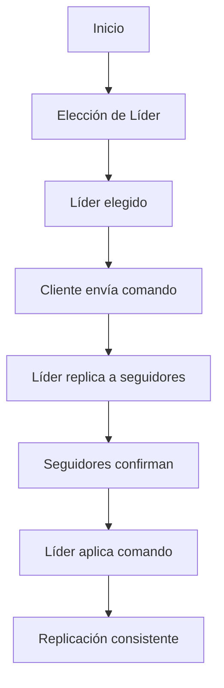
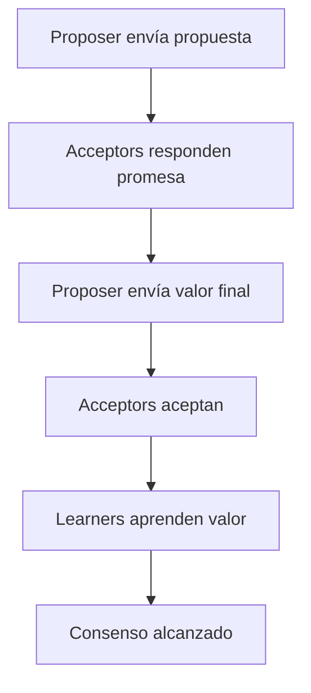
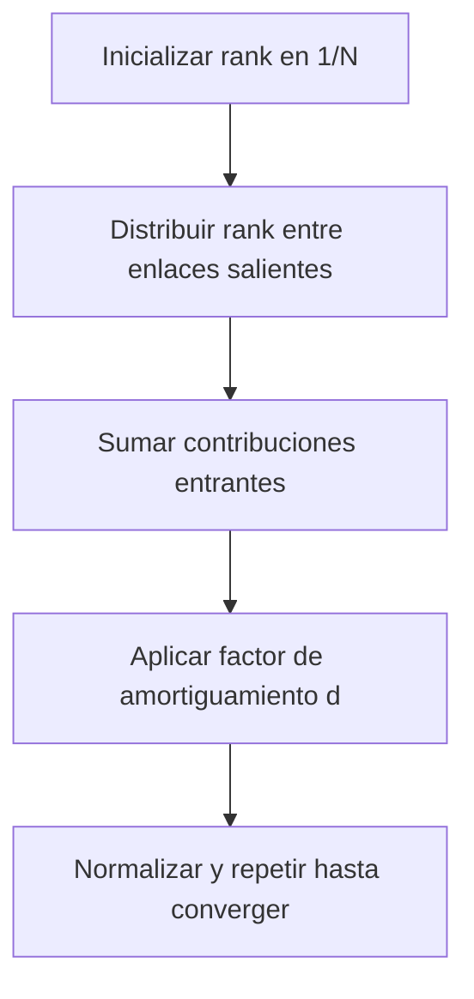
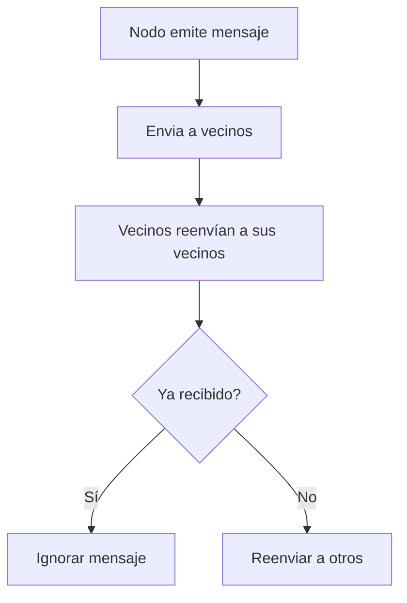

# 🧩 Módulo 4: Estructuras de Datos y Algoritmos Básicos
## **Sección 8: Algoritmos Distribuidos y de Redes**

---

### 🧠 Introducción General

Los **algoritmos distribuidos** permiten que múltiples procesos, ejecutándose en distintos nodos de una red, trabajen coordinadamente para resolver un problema común.
Se aplican en **sistemas de consenso, replicación de datos, procesamiento paralelo y redes P2P**.

Los principales desafíos son la **sincronización, tolerancia a fallos, consistencia y latencia**.

---

## 🔹 8.1. Raft – Consenso Distribuido

**Objetivo / Aplicación:**
Lograr que múltiples servidores (nodos) acuerden un mismo estado del sistema (por ejemplo, una bitácora compartida).
Raft es más fácil de entender y de implementar que Paxos, aunque logran objetivos equivalentes.

**Fundamento teórico:**
Divide el proceso en tres fases:
1. **Elección de líder**
2. **Replicación de log**
3. **Compromiso de entradas**

**Complejidad:** Comunicación O(n) por ciclo · **Clasificación:** Consenso / Tolerante a fallos / Determinístico
**Origen:** **Diego Ongaro y John Ousterhout (2014)**.



```python
# Simulación conceptual de consenso Raft
import random

nodos = ["N1","N2","N3"]
lider = random.choice(nodos)
log = []

def replicar(comando):
    print(f"Líder {lider} propone '{comando}'")
    ack = [n for n in nodos if random.random() > 0.1]
    if len(ack) >= 2:
        log.append(comando)
        print("Consenso alcanzado:", log)
    else:
        print("Fallo en consenso")

replicar("actualizar estado")
```

---

## 🔹 8.2. Paxos – Acuerdo en sistemas distribuidos

**Objetivo / Aplicación:**
Asegurar consenso entre nodos incluso en presencia de fallos de red o procesos.
Usado en sistemas de bases distribuidas como **Google Chubby** o **ZooKeeper**.

**Fundamento teórico:**
Opera con roles: **Proposers**, **Acceptors**, **Learners**, garantizando que sólo una propuesta sea aceptada.
**Complejidad:** O(n²) mensajes por ronda · **Clasificación:** Consenso / Tolerante a fallos / Asíncrono
**Origen:** **Leslie Lamport (1990)**.



```python
import random

def paxos_propuesta(valor):
    acceptors = 5
    votos = 0
    for i in range(acceptors):
        if random.random() > 0.3:
            votos += 1
    if votos > acceptors/2:
        print("Valor aceptado:", valor)
    else:
        print("Fallo de consenso")

paxos_propuesta("x=42")
```

---

## 🔹 8.3. MapReduce – Procesamiento Distribuido

**Objetivo / Aplicación:**
Procesar grandes volúmenes de datos distribuidos en múltiples nodos de manera paralela.
Base de sistemas como **Hadoop** y **Spark**.

**Fundamento teórico:**
Divide el problema en dos fases:
1. **Map:** transforma o clasifica los datos.
2. **Reduce:** combina resultados parciales.
**Complejidad:** O(n/p) por nodo (p = número de nodos) · **Clasificación:** Paralelizable / Determinístico
**Origen:** **Dean y Ghemawat, Google (2004)**.

```mermaid
flowchart TD
A[Datos de entrada] --> B[Fase Map]
B --> C[Mapeo paralelo en nodos]
C --> D[Fase Shuffle (agrupamiento)]
D --> E[Fase Reduce]
E --> F[Resultado combinado]
```

```python
from collections import defaultdict

data = ["uno", "dos", "uno", "tres", "dos", "uno"]

def map_step(palabra): return (palabra, 1)

def reduce_step(mapped):
    resultado = defaultdict(int)
    for k,v in mapped:
        resultado[k]+=v
    return resultado

mapped = [map_step(w) for w in data]
reduced = reduce_step(mapped)
print(dict(reduced))
```

---

## 🔹 8.4. PageRank – Relevancia en Grafos Web

**Objetivo / Aplicación:**
Determinar la **importancia de las páginas web** en función de los enlaces que reciben.
Es la base del algoritmo de clasificación original de **Google Search**.

**Fundamento teórico:**
Modelo de un **pase aleatorio** en un grafo: la probabilidad de estar en una página depende de los enlaces entrantes.
**Complejidad:** O(k·(V+E)) · **Clasificación:** Algoritmo de grafos / Iterativo / Estocástico
**Origen:** **Larry Page y Sergey Brin (1998)**.



```python
def pagerank(grafo, d=0.85, it=10):
    N = len(grafo)
    rank = {n:1/N for n in grafo}
    for _ in range(it):
        nuevo = {n:(1-d)/N for n in grafo}
        for n, enlaces in grafo.items():
            for e in enlaces:
                nuevo[e] += d * rank[n] / len(enlaces)
        rank = nuevo
    return rank

web = {'A':['B','C'], 'B':['C'], 'C':['A'], 'D':['C']}
print(pagerank(web))
```

---

## 🔹 8.5. Flooding y Gossip Protocols

**Objetivo / Aplicación:**
Difundir información en una red de nodos, como en sistemas P2P o detección de fallos.
El flooding propaga mensajes a **todos los vecinos**; los gossip lo hace **aleatoriamente**.

**Fundamento teórico:**
Flooding garantiza cobertura total (con redundancia alta). Gossip reduce tráfico, pero con probabilidad de omisión.
**Complejidad:** Flooding O(E), Gossip O(log n) promedio · **Clasificación:** Difusión / Probabilístico / Distribuido
**Origen:** Modelos de redes descentralizadas (décadas de 1980–2000).



```python
import random

red = {'A':['B','C'], 'B':['A','D'], 'C':['A','D'], 'D':['B','C']}
recibido = set()

def gossip(origen, mensaje, p=0.6):
    if origen in recibido: return
    recibido.add(origen)
    print(f"{origen} recibió: {mensaje}")
    for vecino in red[origen]:
        if random.random() < p:
            gossip(vecino, mensaje)

gossip('A', "actualización del sistema")
```

---

### ✅ Cierre de la Sección 8

Los algoritmos distribuidos son la base del funcionamiento de **internet moderna, sistemas de archivos distribuidos, blockchain, cloud computing y redes sociales**.
- **Raft / Paxos:** consenso y coherencia.
- **MapReduce:** procesamiento masivo.
- **PageRank:** análisis de conectividad.
- **Flooding / Gossip:** difusión resiliente de información.

---
