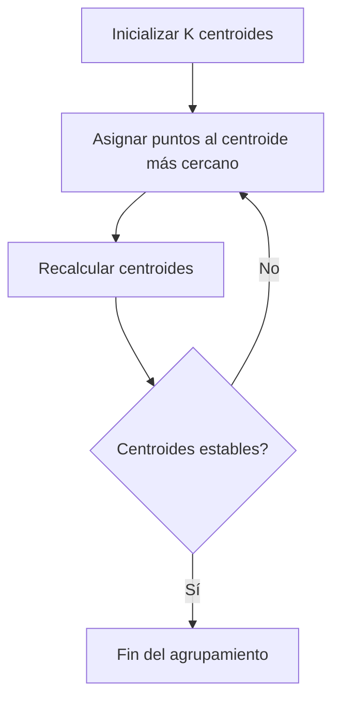
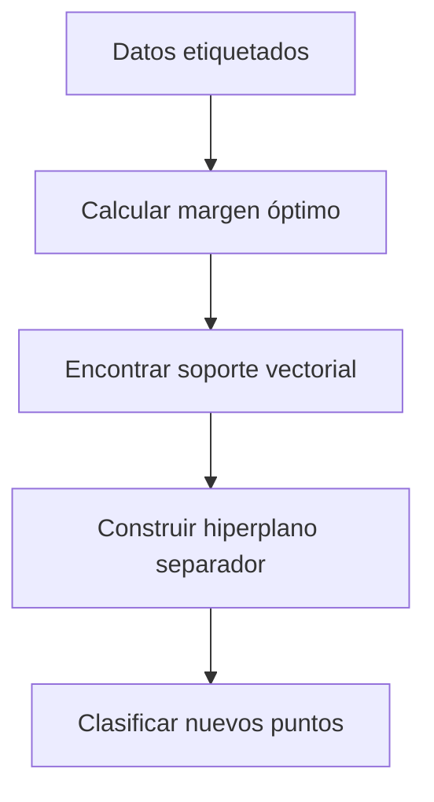
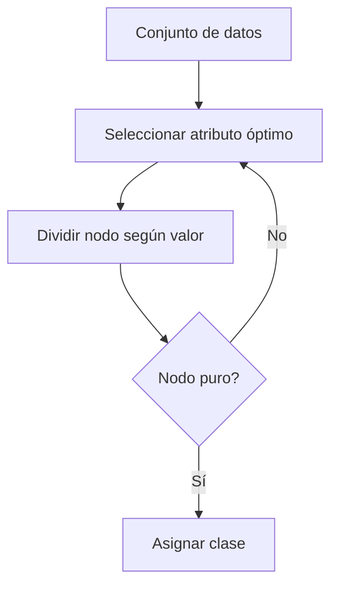
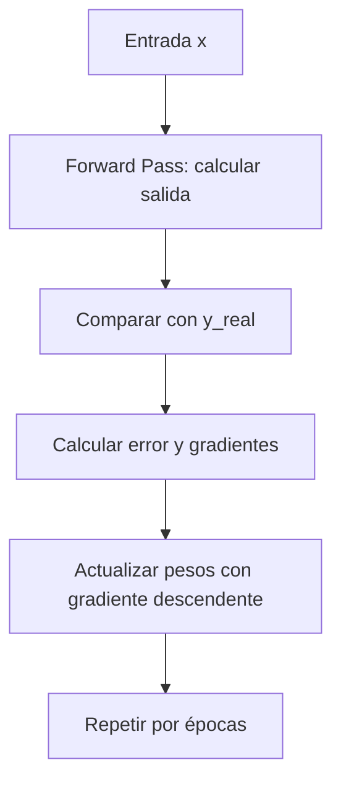

# 🧩 Módulo 4: Estructuras de Datos y Algoritmos Básicos
## **Sección 9: Algoritmos de Aprendizaje Automático**

---

### 🧠 Introducción General

El **aprendizaje automático (Machine Learning)** es una rama de la inteligencia artificial que permite a los sistemas **aprender patrones a partir de datos**, sin ser explícitamente programados para cada tarea.
Los algoritmos de ML se clasifican en:

- **Supervisado:** aprende a partir de ejemplos con etiqueta (p. ej. regresión, clasificación).
- **No supervisado:** encuentra estructura o agrupamientos sin etiquetas (p. ej. K-Means).
- **Por refuerzo:** aprende mediante recompensas o castigos (p. ej. aprendizaje de políticas).

---

## 🔹 9.1. K-Means (Agrupamiento No Supervisado)

**Objetivo / Aplicación:**
Agrupar un conjunto de datos en **K grupos** donde cada punto pertenece al centroide más cercano.

**Fundamento teórico:**
Minimiza la suma de distancias cuadráticas entre los puntos y su centroide.
**Complejidad:** O(n·k·i) (n puntos, k grupos, i iteraciones) · **Clasificación:** No supervisado / Iterativo
**Origen:** **MacQueen (1967)**.



```python
import random

def kmeans(data, k=2, iters=5):
    centroids = random.sample(data, k)
    for _ in range(iters):
        grupos = {i: [] for i in range(k)}
        for x in data:
            dists = [abs(x-c) for c in centroids]
            grupo = dists.index(min(dists))
            grupos[grupo].append(x)
        centroids = [sum(v)/len(v) for v in grupos.values() if v]
    return centroids, grupos

datos = [1,2,3,10,11,12]
print(kmeans(datos, k=2))
```

---

## 🔹 9.2. Naive Bayes

**Objetivo / Aplicación:**
Clasificar elementos basándose en la **probabilidad condicional**. Muy usado en **filtrado de spam, análisis de texto y detección de sentimientos**.

**Fundamento teórico:**
Usa el **Teorema de Bayes** bajo el supuesto de independencia entre variables:
\( P(C|X) = \frac{P(X|C)·P(C)}{P(X)} \)
**Complejidad:** O(n·m) (n muestras, m atributos) · **Clasificación:** Supervisado / Probabilístico
**Origen:** Basado en el trabajo de **Thomas Bayes (1763)**.

```mermaid
flowchart TD
A[Entrenamiento] --> B[Calcular P(C) y P(X|C)]
B --> C[Predicción]
C --> D[Aplicar Teorema de Bayes]
D --> E[Seleccionar clase con mayor probabilidad]
```

```python
def naive_bayes(text, clases):
    palabras = set(sum(clases.values(), []))
    P = {}
    for c, lista in clases.items():
        P[c] = sum(text.count(w) for w in lista) / len(palabras)
    return max(P, key=P.get)

clases = {
    "positivo": ["bueno","excelente","genial"],
    "negativo": ["malo","horrible","terrible"]
}
print(naive_bayes("excelente servicio", clases))
```

---

## 🔹 9.3. Support Vector Machines (SVM)

**Objetivo / Aplicación:**
Encontrar un **hiperplano óptimo** que separe los datos de diferentes clases con el **máximo margen** posible.

**Fundamento teórico:**
Busca maximizar \( \frac{2}{||w||} \) sujeto a que los puntos estén correctamente clasificados:
\( y_i(w·x_i + b) ≥ 1 \).
**Complejidad:** O(n³) · **Clasificación:** Supervisado / Geométrico / Determinístico
**Origen:** **Vapnik y Chervonenkis (1992)**.



```python
# Ejemplo 1D simple
def svm_predict(x, w, b):
    return 1 if w*x + b >= 0 else -1

w, b = 0.5, -2
puntos = [1,3,6]
for x in puntos:
    print(x, "-> clase", svm_predict(x, w, b))
```

---

## 🔹 9.4. Árboles de Decisión y Bosques Aleatorios

**Objetivo / Aplicación:**
Construir reglas jerárquicas de decisión para clasificar datos o realizar regresión.

**Fundamento teórico:**
Divide el espacio de atributos en regiones homogéneas minimizando la **entropía** o el **índice Gini**.
**Complejidad:** O(n·m·log n) · **Clasificación:** Supervisado / No paramétrico
**Origen:** **Breiman et al. (1984)**.



```python
# Árbol simple con 1 atributo: si la temperatura > 25 => 'calor'
def arbol_decision(temp):
    return "calor" if temp > 25 else "frio"

print(arbol_decision(30))
print(arbol_decision(18))
```

---

## 🔹 9.5. Backpropagation (Retropropagación del Error)

**Objetivo / Aplicación:**
Entrenar **redes neuronales artificiales** ajustando los pesos para minimizar el error entre la salida predicha y la deseada.

### 🌐 Fundamento Teórico

Una red neuronal está formada por capas de **neuronas interconectadas**.
Cada neurona aplica una función de activación (sigmoide, ReLU, etc.) sobre una suma ponderada de entradas.

Durante el entrenamiento:
1. Se propagan los datos hacia adelante (**forward pass**).
2. Se calcula el error respecto a la salida real.
3. Se retropropaga el error (**backward pass**) actualizando los pesos mediante el **gradiente descendente**.

**Ecuación de actualización:**
$$w_{ij} := w_{ij} - \alpha · \frac{∂E}{∂w_{ij}} $$
donde $$ E = \frac{1}{2}(y_{real} - y_{pred})^2 $$

**Complejidad:** O(n·m·e) (n neuronas, m conexiones, e épocas)
**Clasificación:** Supervisado / Iterativo / Numérico
**Origen:** **Rumelhart, Hinton y Williams (1986)**
**Importancia actual:** Es la base del **Deep Learning moderno** (redes convolucionales, transformers, etc.).



```python
import math

def sigmoid(x): return 1/(1+math.exp(-x))
def d_sigmoid(y): return y*(1-y)

# Red con 1 neurona: aprende la función identidad
w = 0.5
alpha = 0.1
datos = [(0,0),(1,1)]
for epoch in range(1000):
    total_error = 0
    for x,y in datos:
        # forward
        y_pred = sigmoid(x*w)
        # error
        error = y - y_pred
        # backward
        w += alpha * error * d_sigmoid(y_pred) * x
        total_error += error**2
    if epoch % 200 == 0:
        print(f"época {epoch} error {total_error:.4f} w={w:.3f}")

print("Predicción(1):", sigmoid(1*w))
```

### 🔍 Interpretación

El algoritmo ajusta progresivamente los pesos de la red hasta que las predicciones se aproximan al valor real.
La **retropropagación** es esencial para el entrenamiento de **redes profundas**, donde múltiples capas de neuronas se optimizan en conjunto.

---

### ✅ Cierre de la Sección 9

El aprendizaje automático representa un paradigma donde los algoritmos **extraen conocimiento a partir de datos**.
- **K-Means:** agrupa sin supervisión.
- **Naive Bayes / SVM / Árboles:** clasifican de forma supervisada.
- **Backpropagation:** corazón del **Deep Learning** moderno.

---
